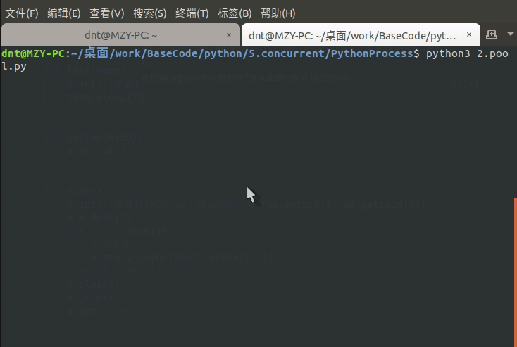
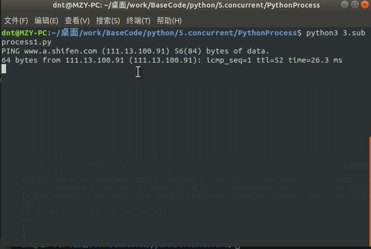
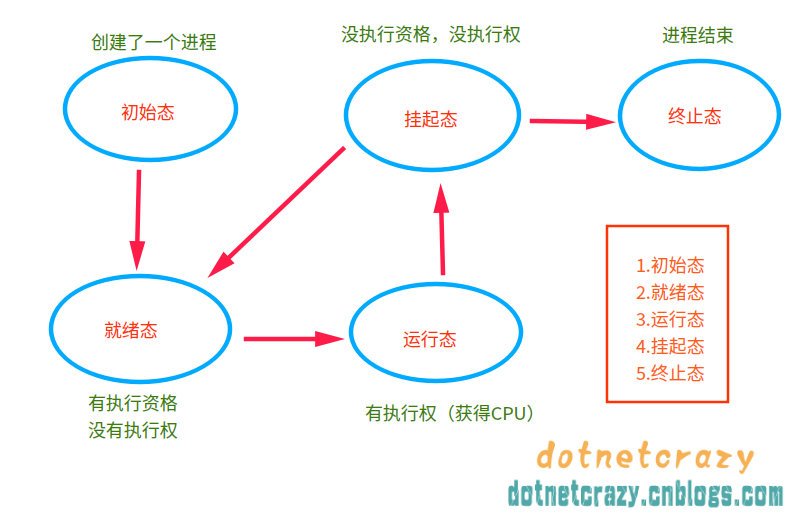
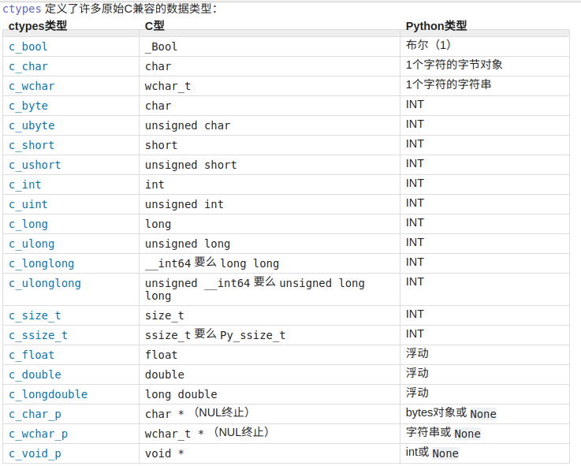
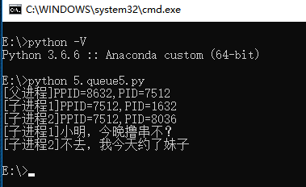
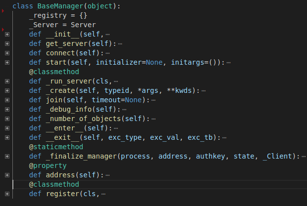
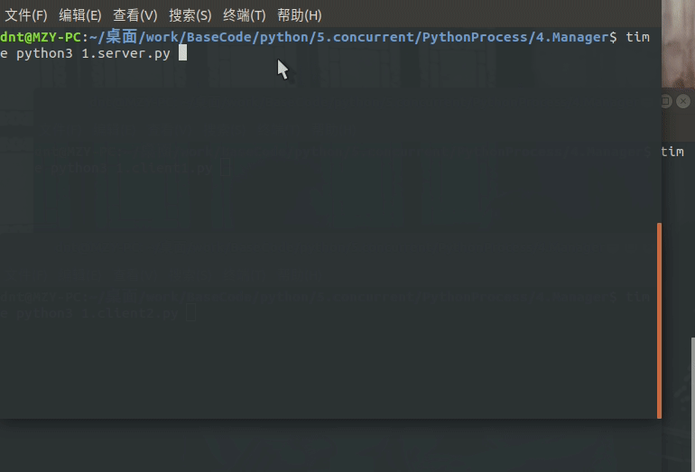
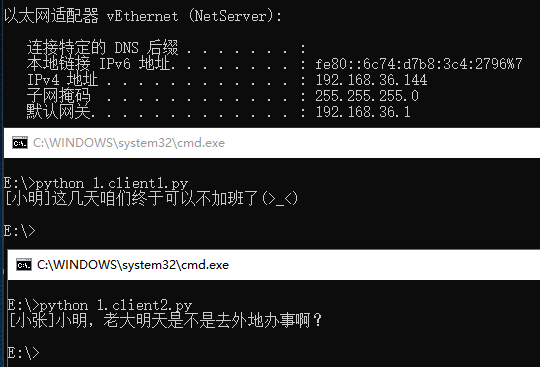

上次说了很多Linux下进程相关知识，这边不再复述，下面来说说Python的并发编程，如有错误欢迎提出～

如果遇到听不懂的可以看上一次的文章：<a href="https://www.cnblogs.com/dotnetcrazy/p/9363810.html" target="_blank">https://www.cnblogs.com/dotnetcrazy/p/9363810.html</a>

官方文档：<a href="https://docs.python.org/3/library/concurrency.html" target="_blank">https://docs.python.org/3/library/concurrency.html</a>

## 1.进程篇

官方文档：<a href="https://docs.python.org/3/library/multiprocessing.html" target="_blank">https://docs.python.org/3/library/multiprocessing.html</a>

Code：<a href="https://github.com/lotapp/BaseCode/tree/master/python/5.concurrent/PythonProcess" target="_blank">https://github.com/lotapp/BaseCode/tree/master/python/5.concurrent/PythonProcess</a>

### 1.1.进程（Process）

Python的进程创建非常方便，看个案例：(这种方法通用，fork只适用于Linux系)
```py
import os
# 注意一下，导入的是Process不是process（Class是大写开头）
from multiprocessing import Process

def test(name):
    print("[子进程-%s]PID：%d，PPID：%d" % (name, os.getpid(), os.getppid()))

def main():
    print("[父进程]PID：%d，PPID：%d" % (os.getpid(), os.getppid()))
    p = Process(target=test, args=("萌萌哒", )) # 单个元素的元组表达别忘了(x,)
    p.start()
    p.join()  # 父进程回收子进程资源（内部调用了wait系列方法）

if __name__ == '__main__':
    main()
```
运行结果：
```
[父进程]PID：25729，PPID：23434
[子进程-萌萌哒]PID：25730，PPID：25729
```

创建子进程时，传入一个执行函数和参数，用start()方法来启动进程即可

`join()`方法是父进程回收子进程的封装（主要是回收<a href="https://www.cnblogs.com/dotnetcrazy/p/9363810.html#2.2.僵尸进程和孤儿进程" target="_blank">僵尸子进程(点我)</a>）

其他参数可以参考源码 or 文档，贴一下源码的`init`方法：

`def __init__(self,group=None,target=None,name=None,args=(),kwargs={},*,daemon=None)`

扩展：`name：为当前进程实例的别名`

1. `p.is_alive()` 判断进程实例p是否还在执行
2. `p.terminate()` 终止进程（发`SIGTERM`信号）

上面的案例如果用OOP来实现就是这样：(如果不指定方法，默认调Run方法)
```py
import os
from multiprocessing import Process

class My_Process(Process):
    # 重写了Proce类的Init方法
    def __init__(self, name):
        self.__name = name
        Process.__init__(self)  # 调用父类方法

    # 重写了Process类的run()方法
    def run(self):
        print("[子进程-%s]PID：%d，PPID：%d" % (self.__name, os.getpid(),
                                          os.getppid()))

def main():
    print("[父进程]PID：%d，PPID：%d" % (os.getpid(), os.getppid()))
    p = My_Process("萌萌哒") # 如果不指定方法，默认调Run方法
    p.start()
    p.join()  # 父进程回收子进程资源（内部调用了wait系列方法）


if __name__ == '__main__':
    main()
```
PS：`multiprocessing.Process`自行处理僵死进程，不用像`os.fork`那样自己建立信号处理程序、安装信号处理程序

---

### 1.1.源码拓展

现在说说里面的一些门道（只想用的可以忽略）

新版本的封装可能多层，这时候可以看看Python3.3.X系列（这个算是Python3早期版本了，很多代码都暴露出来，比较明了直观）

multiprocessing.process.py
```py
# 3.4.x开始，Process有了一个BaseProcess
# https://github.com/python/cpython/blob/3.7/Lib/multiprocessing/process.py
# https://github.com/lotapp/cpython3/tree/master/Lib/multiprocessing/process.py
def join(self, timeout=None):
    '''一直等到子进程over'''
    self._check_closed()
    # 断言（False就触发异常，提示就是后面的内容
    # 开发中用的比较多，部署的时候可以python3 -O xxx 去除所以断言
    assert self._parent_pid == os.getpid(), "只能 join 一个子进程"
    assert self._popen is not None, "只能加入一个已启动的进程"
    res = self._popen.wait(timeout) # 本质就是用了我们之前讲的wait系列
    if res is not None:
        _children.discard(self) # 销毁子进程
```
multiprocessing.popen_fork.py
```py
# 3.4.x开始，在popen_fork文件中（以前是multiprocessing.forking.py）
# https://github.com/python/cpython/blob/3.7/Lib/multiprocessing/popen_fork.py
# https://github.com/lotapp/cpython3/tree/master/Lib/multiprocessing/popen_fork.py
def wait(self, timeout=None):
    if self.returncode is None:
        # 设置超时的一系列处理
        if timeout is not None:
            from multiprocessing.connection import wait
            if not wait([self.sentinel], timeout):
                return None
        # 核心操作
        return self.poll(os.WNOHANG if timeout == 0.0 else 0)
    return self.returncode

# 回顾一下上次说的：os.WNOHANG - 如果没有子进程退出，则不阻塞waitpid()调用
def poll(self, flag=os.WNOHANG):
    if self.returncode is None:
        try:
            # 他的内部调用了waitpid
            pid, sts = os.waitpid(self.pid, flag)
        except OSError as e:
            # 子进程尚未创建
            # e.errno == errno.ECHILD == 10
            return None
        if pid == self.pid:
            if os.WIFSIGNALED(sts):
                self.returncode = -os.WTERMSIG(sts)
            else:
                assert os.WIFEXITED(sts), "Status is {:n}".format(sts)
                self.returncode = os.WEXITSTATUS(sts)
    return self.returncode
```

关于断言的简单说明：（别泛滥）

如果条件为真，它什么都不做，反之它触发一个带可选错误信息的AssertionError

```py
def test(a, b):
    assert b != 0, "哥哥，分母不能为0啊"
    return a / b

def main():
    test(1, 0)

if __name__ == '__main__':
    main()
```
结果：
```
Traceback (most recent call last):
  File "0.assert.py", line 11, in <module>
    main()
  File "0.assert.py", line 7, in main
    test(1, 0)
  File "0.assert.py", line 2, in test
    assert b != 0, "哥哥，分母不能为0啊"
AssertionError: 哥哥，分母不能为0啊
```
运行的时候可以指定`-O参数`来忽略`assert`，eg：

`python3 -O 0.assert.py `
```
Traceback (most recent call last):
  File "0.assert.py", line 11, in <module>
    main()
  File "0.assert.py", line 7, in main
    test(1, 0)
  File "0.assert.py", line 3, in test
    return a / b
ZeroDivisionError: division by zero
```

---

扩展：

<a href="https://docs.python.org/3/library/unittest.html" target="_blank">https://docs.python.org/3/library/unittest.html</a>

<a href="https://www.cnblogs.com/shangren/p/8038935.html" target="_blank">https://www.cnblogs.com/shangren/p/8038935.html</a>

---

### 1.2.进程池

多个进程就不需要自己手动去管理了，有Pool来帮你完成，先看个案例：
```py
import os
import time
from multiprocessing import Pool  # 首字母大写

def test(name):
    print("[子进程-%s]PID=%d，PPID=%d" % (name, os.getpid(), os.getppid()))
    time.sleep(1)

def main():
    print("[父进程]PID=%d，PPID=%d" % (os.getpid(), os.getppid()))
    p = Pool(5) # 设置最多5个进程（不设置就默认为CPU核数）
    for i in range(10):
        # 异步执行
        p.apply_async(test, args=(i, )) # 同步用apply（如非必要不建议用）
    p.close() # 关闭池，不再加入新任务
    p.join() # 等待所有子进程执行完毕回收资源（join可以指定超时时间，eg：`p.join(1)`）
    print("over")

if __name__ == '__main__':
    main()
```
图示：（join可以指定超时时间，eg：`p.join(1)`）


**调用`join()`之前必须先调用`close()`，调用`close()`之后就不能继续添加新的`Process`了**(<a href="#pool.join源码分析" target="_blank">下面会说为什么</a>)

---

### 1.3.源码拓展

验证一下**Pool的默认大小是CPU的核数**，看源码：

multiprocessing.pool.py
```py
# https://github.com/python/cpython/blob/3.7/Lib/multiprocessing/pool.py
# https://github.com/lotapp/cpython3/tree/master/Lib/multiprocessing/pool.py
class Pool(object):
    def __init__(self, processes=指定的进程数,...):
        if processes is None:
            processes = os.cpu_count() or 1 # os.cpu_count() ~ CPU的核数
```
源码里面`apply_async`方法，是有回调函数（callback）的
```py
def apply_async(self,func,args=(),kwds={},callback=None,error_callback=None):
    if self._state != RUN:
        raise ValueError("Pool not running")
    result = ApplyResult(self._cache, callback, error_callback)
    self._taskqueue.put(([(result._job, 0, func, args, kwds)], None))
    return result
```
来看个例子：(和JQ很像)
```py
import os
import time
from multiprocessing import Pool  # 首字母大写

def test(name):
    print("[子进程%s]PID=%d，PPID=%d" % (name, os.getpid(), os.getppid()))
    time.sleep(1)
    return name

def error_test(name):
    print("[子进程%s]PID=%d，PPID=%d" % (name, os.getpid(), os.getppid()))
    raise Exception("[子进程%s]啊，我挂了～" % name)

def callback(result):
    """成功之后的回调函数"""
    print("[子进程%s]执行完毕" % result)  # 没有返回值就为None

def error_callback(msg):
    """错误之后的回调函数"""
    print(msg)

def main():
    print("[父进程]PID=%d，PPID=%d" % (os.getpid(), os.getppid()))
    p = Pool()  # CPU默认核数
    for i in range(5):
        # 搞2个出错的看看
        if i > 2:
            p.apply_async(
                error_test,
                args=(i, ),
                callback=callback,
                error_callback=error_callback)  # 异步执行
        else:
            # 异步执行，成功后执行callback函数（有点像jq）
            p.apply_async(test, args=(i, ), callback=callback)
    p.close()  # 关闭池，不再加入新任务
    p.join()  # 等待所有子进程执行完毕回收资源
    print("over")

if __name__ == '__main__':
    main()
```

输出：
```
[父进程]PID=12348，PPID=10999
[子进程0]PID=12349，PPID=12348
[子进程2]PID=12351，PPID=12348
[子进程1]PID=12350，PPID=12348
[子进程3]PID=12352，PPID=12348
[子进程4]PID=12352，PPID=12348
[子进程3]啊，我挂了～
[子进程4]啊，我挂了～
[子进程0]执行完毕
[子进程2]执行完毕
[子进程1]执行完毕
over
```

接着上面继续拓展，补充说说获取函数返回值。`上面是通过成功后的回调函数来获取返回值`，这次说说自带的方法：
```py
import time
from multiprocessing import Pool, TimeoutError

def test(x):
    """开平方"""
    time.sleep(1)
    return x * x

def main():
    pool = Pool()
    task = pool.apply_async(test, (10, ))
    print(task)
    try:
        print(task.get(timeout=1))
    except TimeoutError as ex:
        print("超时了～", ex)

if __name__ == '__main__':
    main()
```
输出：（`apply_async`返回一个`ApplyResult`类，里面有个get方法可以获取返回值）
```
<multiprocessing.pool.ApplyResult object at 0x7fbc354f50b8>
超时了～
```
再举个例子，顺便把`Pool`里面的`map`和`imap`方法搞个案例（类比jq）
```py
import time
from multiprocessing import Pool

def test(x):
    return x * x

if __name__ == '__main__':
    with Pool(processes=4) as pool:
        task = pool.apply_async(test, (10, ))
        print(task.get(timeout=1))

        obj_list = pool.map(test, range(10))
        print(obj_list)
        # 返回一个可迭代类的实例对象
        obj_iter = pool.imap(test, range(10))
        print(obj_iter)
        next(obj_iter)
        for i in obj_iter:
            print(i, end=" ")
```
输出：
```
100
[0, 1, 4, 9, 16, 25, 36, 49, 64, 81]
<multiprocessing.pool.IMapIterator object at 0x7ff7f9734198>
1 4 9 16 25 36 49 64 81 
```
微微看一眼源码：(基础忘了可以查看==> <a href="https://www.cnblogs.com/dotnetcrazy/p/9278573.html" target="_blank">点我</a> )

```py
class IMapIterator(object):
    def __init__(self, cache):
        self._cond = threading.Condition(threading.Lock())
        self._job = next(job_counter)
        self._cache = cache
        self._items = collections.deque()
        self._index = 0
        self._length = None
        self._unsorted = {}
        cache[self._job] = self
    
    def __iter__(self):
        return self # 返回一个迭代器

    # 实现next方法
    def next(self, timeout=None):
        with self._cond:
            try:
                item = self._items.popleft()
            except IndexError:
                if self._index == self._length:
                    raise StopIteration from None
                self._cond.wait(timeout)
                try:
                    item = self._items.popleft()
                except IndexError:
                    if self._index == self._length:
                        raise StopIteration from None
                    raise TimeoutError from None

        success, value = item
        if success:
            return value
        raise value
......
```

扩展：优雅杀死子进程的探讨 <a href="https://segmentfault.com/q/1010000005077517" target="_blank">https://segmentfault.com/q/1010000005077517</a>

---

### 1.4.拓展之subprocess

官方文档：<a href="https://docs.python.org/3/library/subprocess.html" target="_blank">https://docs.python.org/3/library/subprocess.html</a>

还记得之前李代桃僵的`execlxxx`系列吗？

这不，`subprocess`就是它的一层封装，当然了要强大的多，先看个例子：（以`os.execlp`的例子为引）
```py
import subprocess

def main():
    # os.execlp("ls", "ls", "-al")  # 执行Path环境变量可以搜索到的命令
    result = subprocess.run(["ls", "-al"])
    print(result)

if __name__ == '__main__':
    main()
```
输出
```
总用量 44
drwxrwxr-x 2 dnt dnt 4096 8月   7 17:32 .
drwxrwxr-x 4 dnt dnt 4096 8月   6 08:01 ..
-rw-rw-r-- 1 dnt dnt  151 8月   3 10:49 0.assert.py
-rw-rw-r-- 1 dnt dnt  723 8月   5 18:00 1.process2.py
-rw-rw-r-- 1 dnt dnt  501 8月   3 10:20 1.process.py
-rw-rw-r-- 1 dnt dnt 1286 8月   6 08:16 2.pool1.py
-rw-rw-r-- 1 dnt dnt  340 8月   7 16:38 2.pool2.py
-rw-rw-r-- 1 dnt dnt  481 8月   7 16:50 2.pool3.py
-rw-rw-r-- 1 dnt dnt  652 8月   5 17:01 2.pool.py
-rw-rw-r-- 1 dnt dnt  191 8月   7 17:33 3.subprocess.py
CompletedProcess(args=['ls', '-al'], returncode=0)
```
#### 文档

现在看下官方的文档描述来理解一下：
```py
r"""
具有可访问I / O流的子进程
Subprocesses with accessible I/O streams

此模块允许您生成进程，连接到它们输入/输出/错误管道，并获取其返回代码。
This module allows you to spawn processes, connect to their
input/output/error pipes, and obtain their return codes.

完整文档可以查看：https://docs.python.org/3/library/subprocess.html
For a complete description of this module see the Python documentation.

Main API
========
run(...): 运行命令，等待它完成，然后返回`CompletedProcess`实例。
Runs a command, waits for it to complete, 
then returns a CompletedProcess instance.

Popen(...): 用于在新进程中灵活执行命令的类
A class for flexibly executing a command in a new process

Constants（常量）
---------
DEVNULL: 特殊值，表示应该使用`os.devnull`
Special value that indicates that os.devnull should be used

PIPE:    表示应创建`PIPE`管道的特殊值
Special value that indicates a pipe should be created

STDOUT:  特殊值，表示`stderr`应该转到`stdout`
Special value that indicates that stderr should go to stdout

Older API（尽量不用，说不定以后就淘汰了）
=========
call(...): 运行命令，等待它完成，然后返回返回码。
Runs a command, waits for it to complete, then returns the return code.

check_call(...): Same as call() but raises CalledProcessError()
    if return code is not 0（返回值不是0就引发异常）
    
check_output(...): 与check_call（）相同,但返回`stdout`的内容,而不是返回代码
Same as check_call but returns the contents of stdout instead of a return code

getoutput(...): 在shell中运行命令，等待它完成，然后返回输出
Runs a command in the shell, waits for it to complete,then returns the output

getstatusoutput(...): 在shell中运行命令，等待它完成，然后返回一个（exitcode，output）元组
Runs a command in the shell, waits for it to complete,
then returns a (exitcode, output) tuple
"""
```
其实看看源码很有意思：（内部其实就是调用的`os.popen`【进程先导篇讲进程守护的时候用过】）
```py
def run(*popenargs, input=None, capture_output=False,
        timeout=None, check=False, **kwargs):
    
    if input is not None:
        if 'stdin' in kwargs:
            raise ValueError('stdin和输入参数可能都不会被使用。')
        kwargs['stdin'] = PIPE

    if capture_output:
        if ('stdout' in kwargs) or ('stderr' in kwargs):
            raise ValueError('不能和capture_outpu一起使用stdout 或 stderr')
        kwargs['stdout'] = PIPE
        kwargs['stderr'] = PIPE

    with Popen(*popenargs, **kwargs) as process:
        try:
            stdout, stderr = process.communicate(input, timeout=timeout)
        except TimeoutExpired:
            process.kill()
            stdout, stderr = process.communicate()
            raise TimeoutExpired(
                process.args, timeout, output=stdout, stderr=stderr)
        except:  # 包括KeyboardInterrupt的通信处理。
            process.kill()
            # 不用使用process.wait（），.__ exit__为我们做了这件事。
            raise
        retcode = process.poll()
        if check and retcode:
            raise CalledProcessError(
                retcode, process.args, output=stdout, stderr=stderr)
    return CompletedProcess(process.args, retcode, stdout, stderr)
```
返回值类型：`CompletedProcess`
```py
# https://github.com/lotapp/cpython3/blob/master/Lib/subprocess.py
class CompletedProcess(object):
    def __init__(self, args, returncode, stdout=None, stderr=None):
        self.args = args
        self.returncode = returncode
        self.stdout = stdout
        self.stderr = stderr

    def __repr__(self):
    """对象按指定的格式显示"""
        args = [
            'args={!r}'.format(self.args),
            'returncode={!r}'.format(self.returncode)
        ]
        if self.stdout is not None:
            args.append('stdout={!r}'.format(self.stdout))
        if self.stderr is not None:
            args.append('stderr={!r}'.format(self.stderr))
        return "{}({})".format(type(self).__name__, ', '.join(args))

    def check_returncode(self):
        """如果退出代码非零，则引发CalledProcessError"""
        if self.returncode:
            raise CalledProcessError(self.returncode, self.args, self.stdout,
                                     self.stderr)
```

#### 简单demo

再来个案例体会一下方便之处：
```py
import subprocess

def main():
    result = subprocess.run(["ping", "www.baidu.com"])
    print(result.stdout)

if __name__ == '__main__':
    main()
```
图示：


#### 交互demo

再来个强大的案例（交互的程序都可以，比如 **`ftp`，`nslookup`** 等等）：`popen1.communicate`
```py
import subprocess

def main():
    process = subprocess.Popen(
        ["ipython3"],
        stdin=subprocess.PIPE,
        stdout=subprocess.PIPE,
        stderr=subprocess.PIPE)
    try:
        # 对pstree进行交互
        out, err = process.communicate(input=b'print("hello")', timeout=3)
        print("Out:%s\nErr:%s" % (out.decode(), err.decode()))
    except TimeoutError:
        # 如果超时到期，则子进程不会被终止，需要自己处理一下
        process.kill()
        out, err = process.communicate()
        print("Out:%s\nErr:%s" % (out.decode(), err.decode()))

if __name__ == '__main__':
    main()
```
输出：
```
IPython 6.4.0 -- An enhanced Interactive Python. Type '?' for help.

In [1]: hello

In [2]: Do you really want to exit ([y]/n)?

Err:
```
注意点：如果超时到期，则子进程不会被终止，需要自己处理一下（官方提醒）


#### 通信demo

这个等会说进程间通信还会说，所以简单举个例子，老规矩拿`ps aux | grep bash`说事：
```py
import subprocess


def main():
    # ps aux | grep bash
    # 进程1获取结果
    p1 = subprocess.Popen(["ps", "-aux"], stdout=subprocess.PIPE)
    # 得到进程1的结果再进行筛选
    p2 = subprocess.Popen(["grep", "bash"], stdin=p1.stdout, stdout=subprocess.PIPE)
    # 关闭写段（结果已经获取到进程2中了，防止干扰显示）
    p1.stdout.close()
    # 与流程交互：将数据发送到stdin并关闭它。
    msg_tuple = p2.communicate()
    # 输出结果
    print(msg_tuple[0].decode())

if __name__ == '__main__':
    main()
```
输出：（以前案例：<a href="https://www.cnblogs.com/dotnetcrazy/p/9363810.html#2.4.3.进程间通信～PIPE匿名管道（常用）" target="_blank">进程间通信～PIPE匿名管道</a>）
```
dnt       2470  0.0  0.1  24612  5236 pts/0    Ss   06:01   0:00 bash
dnt       2512  0.0  0.1  24744  5760 pts/1    Ss   06:02   0:00 bash
dnt      20784  0.0  0.1  24692  5588 pts/2    Ss+  06:21   0:00 /bin/bash
dnt      22377  0.0  0.0  16180  1052 pts/1    S+   06:30   0:00 grep bash
```

其他扩展可以看看这篇文章：<a href="http://www.cnblogs.com/Security-Darren/p/4733368.html" target="_blank">subprocess与Popen()</a>

### 1.5.进程间通信～PIPE管道通信

这个比较有意思，看个案例：
```py
from multiprocessing import Process, Pipe

def test(w):
    w.send("[子进程]老爸，老妈回来记得喊我一下～")
    msg = w.recv()
    print(msg)

def main():
    r, w = Pipe()
    p1 = Process(target=test, args=(w, ))
    p1.start()
    msg = r.recv()
    print(msg)
    r.send("[父进程]滚犊子，赶紧写作业，不然我得跪方便面！")
    p1.join()

if __name__ == '__main__':
    main()
```
结果：
```
老爸，老妈回来记得喊我一下～
滚犊子，赶紧写作业，不然我得跪方便面！
```
#### multiprocessing.Pipe源码分析

按照道理应该子进程自己写完自己读了，和上次讲得不一样啊？不急，先看看源码：
```py
# https://github.com/lotapp/cpython3/blob/master/Lib/multiprocessing/context.py
def Pipe(self, duplex=True):
    '''返回由管道连接的两个连接对象'''
    from .connection import Pipe
    return Pipe(duplex)
```
看看`connection.Pipe`方法的定义部分，是不是双向通信就看你是否设置`duplex=True`
```py
# https://github.com/lotapp/cpython3/blob/master/Lib/multiprocessing/connection.py
if sys.platform != 'win32':
    def Pipe(duplex=True):
        '''返回管道两端的一对连接对象'''
        if duplex:
            # 双工内部其实是socket系列（下次讲）
            s1, s2 = socket.socketpair()
            s1.setblocking(True)
            s2.setblocking(True)
            c1 = Connection(s1.detach())
            c2 = Connection(s2.detach())
        else:
            # 这部分就是我们上次讲的pipe管道
            fd1, fd2 = os.pipe()
            c1 = Connection(fd1, writable=False)
            c2 = Connection(fd2, readable=False)
        return c1, c2
else: 
    def Pipe(duplex=True):
        # win平台的一系列处理
        ......
        c1 = PipeConnection(h1, writable=duplex)
        c2 = PipeConnection(h2, readable=duplex)
        return c1, c2
```
通过源码知道了，原来双工是通过socket搞的啊～

再看个和原来一样效果的案例：（不用关来关去的了，方便！）
```py
from multiprocessing import Process, Pipe

def test(w):
    # 只能写
    w.send("[子进程]老爸，咱们完了，老妈一直在门口～")

def main():
    r, w = Pipe(duplex=False)
    p1 = Process(target=test, args=(w, ))
    p1.start() # 你把这个放在join前面就直接死锁了
    msg = r.recv() # 只能读
    print(msg)
    p1.join()

if __name__ == '__main__':
    main()
```
输出：（可以思考下为什么`start换个位置就死锁`，提示：`阻塞读写`）
```
[子进程]老爸，咱们完了，老妈一直在门口～
```

再举个`Pool`的例子，咱们就进入今天的重点了：
```py
from multiprocessing import Pipe, Pool

def proc_test1(conn):
    conn.send("[小明]小张，今天哥们要见一女孩，你陪我呗，我24h等你回复哦～")
    msg = conn.recv()
    print(msg)

def proc_test2(conn):
    msg = conn.recv()
    print(msg)
    conn.send("[小张]不去，万一被我帅气的外表迷倒就坑了～")

def main():
    conn1, conn2 = Pipe()
    p = Pool()
    p.apply_async(proc_test1, (conn1, ))
    p.apply_async(proc_test2, (conn2, ))
    p.close()  # 关闭池，不再接收新任务
    p.join()  # 等待回收，必须先关才能join，不然会异常

if __name__ == '__main__':
    main()
```
输出：
```py
[小明]小张，今天哥们要见一女孩，你陪我呗，我24h等你回复哦～
[小张]不去，万一被我帅气的外表迷倒就坑了～
```
#### pool.join源码分析

看看源码就理解了：**看看Pool的join是啥情况？看源码：**
```py
# https://github.com/python/cpython/blob/3.7/Lib/multiprocessing/pool.py
# https://github.com/lotapp/cpython3/blob/master/Lib/multiprocessing/pool.py
def join(self):
    util.debug('joining pool')
    if self._state == RUN:
        # 没关闭就join，这边就会抛出一个异常
        raise ValueError("Pool is still running")
    elif self._state not in (CLOSE, TERMINATE):
        raise ValueError("In unknown state")
    self._worker_handler.join()
    self._task_handler.join()
    self._result_handler.join()
    for p in self._pool:
        p.join() # 循环join回收
```
在pool的`__init__`的方法中，这几个属性：
```py
self._processes = processes # 指定的进程数
self._pool = [] # 列表
self._repopulate_pool() # 给列表append内容的方法
```
将池进程的数量增加到指定的数量，join的时候会使用这个列表
```py
def _repopulate_pool(self):
    # 指定进程数-当前进程数，差几个补几个
    for i in range(self._processes - len(self._pool)):
        w = self.Process(target=worker,
                         args=(self._inqueue, self._outqueue,
                               self._initializer,
                               self._initargs, self._maxtasksperchild,
                               self._wrap_exception)
                        )
        self._pool.append(w) # 重点来了
        w.name = w.name.replace('Process', 'PoolWorker')
        w.daemon = True # pool退出后，通过pool创建的进程都会退出
        w.start()
        util.debug('added worker')
```
注意：**池的方法只能由创建它的进程使用**

---

### 1.5.进程间通信～Queue管道通信（常用）

一步步的设局，从底层的的`pipe()`->`os.pipe`->`PIPE`，现在终于到`Queue`了，心酸啊，明知道上面两个项目

里面基本上不会用，但为了你们能看懂源码，说了这么久`%>_<%`其实以后当我们从`Queue`说到`MQ`和`RPC`之后，现在

讲得这些进程间通信(`IPC`)也基本上不会用了，但本质你得清楚，我尽量多分析点源码，这样你们以后看开源项目压力会很小

欢迎批评指正～

#### 引入案例

```py
from multiprocessing import Process, Queue

def test(q):
    q.put("[子进程]老爸，我出去嗨了")
    print(q.get())

def main():
    q = Queue()
    p = Process(target=test, args=(q, ))
    p.start()
    msg = q.get()
    print(msg)
    q.put("[父进程]去吧比卡丘～")
    p.join()

if __name__ == '__main__':
    main()
```
输出：（`get`和`put`默认是阻塞等待的）
```
[子进程]老爸，我出去嗨了
[父进程]去吧比卡丘～
```

#### 源码拓展

先看看`Queue`的初始化方法：（不指定大小就是最大队列数）
```py
# 队列类型，使用PIPE，缓存，线程
class Queue(object):
    # ctx = multiprocessing.get_context("xxx")
    # 上下文总共3种：spawn、fork、forkserver（扩展部分会提一下）
    def __init__(self, maxsize=0, *, ctx):
        # 默认使用最大容量
        if maxsize <= 0:
            from .synchronize import SEM_VALUE_MAX as maxsize
        self._maxsize = maxsize  # 指定队列大小
        # 创建了一个PIPE匿名管道（单向）
        self._reader, self._writer = connection.Pipe(duplex=False)
        # `multiprocessing/synchronize.py > Lock`
        self._rlock = ctx.Lock()  # 进程锁（读）【非递归】
        self._opid = os.getpid()  # 获取PID
        if sys.platform == 'win32':
            self._wlock = None
        else:
            self._wlock = ctx.Lock()  # 进程锁（写）【非递归】
        # Semaphore信号量通常用于保护容量有限的资源
        # 控制信号量,超了就异常
        self._sem = ctx.BoundedSemaphore(maxsize)
        # 不忽略PIPE管道破裂的错误
        self._ignore_epipe = False 
        # 线程相关操作
        self._after_fork()
        # 向`_afterfork_registry`字典中注册
        if sys.platform != 'win32':
            register_after_fork(self, Queue._after_fork)
```
关于`get`和`put`是阻塞的问题，看下源码探探究竟：

`q.get()`：收消息
```py
def get(self, block=True, timeout=None):
    # 默认情况是阻塞（lock加锁）
    if block and timeout is None:
        with self._rlock:
            res = self._recv_bytes()
        self._sem.release()  # 信号量+1
    else:
        if block:
            deadline = time.monotonic() + timeout
        # 超时抛异常
        if not self._rlock.acquire(block, timeout):
            raise Empty
        try:
            if block:
                timeout = deadline - time.monotonic()
                # 不管有没有内容都去读，超时就抛异常
                if not self._poll(timeout):
                    raise Empty
            elif not self._poll():
                raise Empty
            # 接收字节数据作为字节对象
            res = self._recv_bytes()
            self._sem.release()  # 信号量+1
        finally:
            # 释放锁
            self._rlock.release()
    # 释放锁后，重新序列化数据
    return _ForkingPickler.loads(res)
```
`queue.put()`:发消息
```py
def put(self, obj, block=True, timeout=None):
        # 如果Queue已经关闭就抛异常
        assert not self._closed, "Queue {0!r} has been closed".format(self)
        # 记录信号量的锁
        if not self._sem.acquire(block, timeout):
            raise Full  # 超过数量，抛个异常
        # 条件变量允许一个或多个线程等待，直到另一个线程通知它们
        with self._notempty:
            if self._thread is None:
                self._start_thread()
            self._buffer.append(obj)
            self._notempty.notify()
```

非阻塞`get_nowait`和`put_nowait`本质其实也是调用了`get`和`put`方法：
```py
def get_nowait(self):
    return self.get(False)

def put_nowait(self, obj):
    return self.put(obj, False)
```

#### 进程间通信1

说这么多不如来个例子看看：
```py
from multiprocessing import Queue

def main():
    q = Queue(3)  # 只能 put 3条消息
    q.put([1, 2, 3, 4])  # put一个List类型的消息
    q.put({"a": 1, "b": 2})  # put一个Dict类型的消息
    q.put({1, 2, 3, 4})  # put一个Set类型的消息

    try:
        # 不加timeout，就一直阻塞，等消息队列有空位才能发出去
        q.put("再加条消息呗", timeout=2)
    # Full(Exception)是空实现，你可以直接用Exception
    except Exception:
        print("消息队列已满，队列数%s，当前存在%s条消息" % (q._maxsize, q.qsize()))

    try:
        # 非阻塞，不能put就抛异常
        q.put_nowait("再加条消息呗")  # 相当于q.put(obj,False)
    except Exception:
        print("消息队列已满，队列数%s，当前存在%s条消息" % (q._maxsize, q.qsize()))

    while not q.empty():
        print("队列数：%s，当前存在%s条消息 内容%s" % (q._maxsize, q.qsize(), q.get_nowait()))

    print("队列数：%s，当前存在：%s条消息" % (q._maxsize, q.qsize()))

if __name__ == '__main__':
    main()
```
输出：
```
消息队列已满，队列数3，当前存在3条消息
消息队列已满，队列数3，当前存在3条消息
队列数：3，当前存在3条消息 内容[1, 2, 3, 4]
队列数：3，当前存在2条消息 内容{'a': 1, 'b': 2}
队列数：3，当前存在1条消息 内容{1, 2, 3, 4}
队列数：3，当前存在：0条消息
```
补充说明一下：
1. *`q._maxsize`* 队列数(尽量不用`_`开头的属性和方法）
2. `q.qsize()`查看当前队列中存在几条消息
3. `q.full()`查看是否满了
4. `q.empty()`查看是否为空

再看个简单点的子进程间通信：(铺垫demo)
```py
import os
import time
from multiprocessing import Process, Queue

def pro_test1(q):
    print("[子进程1]PPID=%d,PID=%d,GID=%d"%(os.getppid(), os.getpid(), os.getgid()))
    q.put("[子进程1]小明，今晚撸串不？")

    # 设置一个简版的重试机制（三次重试）
    for i in range(3):
        if not q.empty():
            print(q.get())
            break
        else:
            time.sleep((i + 1) * 2)  # 第一次1s，第二次4s，第三次6s

def pro_test2(q):
    print("[子进程2]PPID=%d,PID=%d,GID=%d"%(os.getppid(), os.getpid(), os.getgid()))
    print(q.get())
    time.sleep(4)  # 模拟一下网络延迟
    q.put("[子进程2]不去，我今天约了妹子")

def main():
    queue = Queue()
    p1 = Process(target=pro_test1, args=(queue, ))
    p2 = Process(target=pro_test2, args=(queue, ))
    p1.start()
    p2.start()
    p1.join()
    p2.join()

if __name__ == '__main__':
    main()
```
输出：（`time python3 5.queue2.py`）
```
[子进程1]PPID=15220,PID=15221,GID=1000
[子进程2]PPID=15220,PID=15222,GID=1000
[子进程1]小明，今晚撸串不？
[子进程2]不去，我今天约了妹子

real	0m6.087s
user	0m0.053s
sys	0m0.035s
```

---

#### 进程间通信2

多进程基本上都是用`pool`，可用上面说的`Queue`方法怎么报错了？
```py
import os
import time
from multiprocessing import Pool, Queue

def error_callback(msg):
    print(msg)

def pro_test1(q):
    print("[子进程1]PPID=%d,PID=%d,GID=%d" % (os.getppid(), os.getpid(),
                                           os.getgid()))
    q.put("[子进程1]小明，今晚撸串不？")

    # 设置一个简版的重试机制（三次重试）
    for i in range(3):
        if not q.empty():
            print(q.get())
            break
        else:
            time.sleep((i + 1) * 2)  # 第一次1s，第二次4s，第三次6s

def pro_test2(q):
    print("[子进程2]PPID=%d,PID=%d,GID=%d" % (os.getppid(), os.getpid(),
                                           os.getgid()))
    print(q.get())
    time.sleep(4)  # 模拟一下网络延迟
    q.put("[子进程2]不去，我今天约了妹子")

def main():
    print("[父进程]PPID=%d,PID=%d,GID=%d" % (os.getppid(), os.getpid(),
                                          os.getgid()))
    queue = Queue()
    p = Pool()
    p.apply_async(pro_test1, args=(queue, ), error_callback=error_callback)
    p.apply_async(pro_test2, args=(queue, ), error_callback=error_callback)
    p.close()
    p.join()

if __name__ == '__main__':
    main()
```
输出：(无法将`multiprocessing.Queue`对象传递给`Pool`方法)
```
[父进程]PPID=4223,PID=32170,GID=1000
Queue objects should only be shared between processes through inheritance
Queue objects should only be shared between processes through inheritance

real	0m0.183s
user	0m0.083s
sys	0m0.012s
```
下面会详说，先看一下正确方式：（队列换了一下，其他都一样`Manager().Queue()`）
```py
import os
import time
from multiprocessing import Pool, Manager

def error_callback(msg):
    print(msg)

def pro_test1(q):
    print("[子进程1]PPID=%d,PID=%d,GID=%d" % (os.getppid(), os.getpid(),
                                           os.getgid()))
    q.put("[子进程1]小明，今晚撸串不？")

    # 设置一个简版的重试机制（三次重试）
    for i in range(3):
        if not q.empty():
            print(q.get())
            break
        else:
            time.sleep((i + 1) * 2)  # 第一次1s，第二次4s，第三次6s

def pro_test2(q):
    print("[子进程2]PPID=%d,PID=%d,GID=%d" % (os.getppid(), os.getpid(),
                                           os.getgid()))
    print(q.get())
    time.sleep(4)  # 模拟一下网络延迟
    q.put("[子进程2]不去，我今天约了妹子")

def main():
    print("[父进程]PPID=%d,PID=%d,GID=%d" % (os.getppid(), os.getpid(),
                                          os.getgid()))
    queue = Manager().Queue()
    p = Pool()
    p.apply_async(pro_test1, args=(queue, ), error_callback=error_callback)
    p.apply_async(pro_test2, args=(queue, ), error_callback=error_callback)
    p.close()
    p.join()

if __name__ == '__main__':
    main()
```
输出：
```
[父进程]PPID=4223,PID=31329,GID=1000
[子进程1]PPID=31329,PID=31335,GID=1000
[子进程2]PPID=31329,PID=31336,GID=1000
[子进程1]小明，今晚撸串不？
[子进程2]不去，我今天约了妹子

real	0m6.134s
user	0m0.133s
sys	0m0.035s
```
再抛个思考题：（Linux）
```py
import os
import time
from multiprocessing import Pool, Queue

def error_callback(msg):
    print(msg)

q = Queue()

def pro_test1():
    global q
    print("[子进程1]PPID=%d,PID=%d,GID=%d" % (os.getppid(), os.getpid(),
                                           os.getgid()))
    q.put("[子进程1]小明，今晚撸串不？")
    # 设置一个简版的重试机制（三次重试）
    for i in range(3):
        if not q.empty():
            print(q.get())
            break
        else:
            time.sleep((i + 1) * 2)  # 第一次1s，第二次4s，第三次6s

def pro_test2():
    global q
    print("[子进程2]PPID=%d,PID=%d,GID=%d" % (os.getppid(), os.getpid(),
                                           os.getgid()))
    print(q.get())
    time.sleep(4)  # 模拟一下网络延迟
    q.put("[子进程2]不去，我今天约了妹子")

def main():
    print("[父进程]PPID=%d,PID=%d,GID=%d" % (os.getppid(), os.getpid(),
                                          os.getgid()))
    q = Queue()
    p = Pool()
    p.apply_async(pro_test1, error_callback=error_callback)
    p.apply_async(pro_test2, error_callback=error_callback)
    p.close()
    p.join()

if __name__ == '__main__':
    main()
```
输出：（为啥这样也可以【提示：`fork`】）
```
[父进程]PPID=12855,PID=16879,GID=1000
[子进程1]PPID=16879,PID=16880,GID=1000
[子进程2]PPID=16879,PID=16881,GID=1000
[子进程1]小明，今晚撸串不？
[子进程2]不去，我今天约了妹子

real    0m6.120s
user    0m0.105s
sys     0m0.024s
```

### 进程拓展

官方参考：<a href="https://docs.python.org/3/library/multiprocessing.html" target="_blank">https://docs.python.org/3/library/multiprocessing.html</a>

#### 1.上下文系

1. spawn：（Win默认，Linux下也可以用【>=3.4】）
    1. 父进程启动一个新的python解释器进程。
    2. 子进程只会继承运行进程对象run()方法所需的那些资源。
    3. 不会继承父进程中不必要的文件描述符和句柄。
    4. 与使用fork或forkserver相比，使用此方法启动进程相当慢。
    5. 可在Unix和Windows上使用。Windows上的默认设置。
2. fork:（Linux下默认）
    1. 父进程用于os.fork()分叉Python解释器。
    2. 子进程在开始时与父进程相同（这时候内部变量之类的还没有被修改）
    3. 父进程的所有资源都由子进程继承（用到多线程的时候可能有些问题）
    4. 仅适用于Unix。Unix上的默认值。
3. forkserver：（常用）
    1. 当程序启动并选择forkserver start方法时，将启动服务器进程。
    2. 从那时起，每当需要一个新进程时，父进程就会连接到服务器并请求它分叉一个新进程。
    3. fork服务器进程是单线程的，因此它可以安全使用os.fork()。没有不必要的资源被继承。
    4. 可在Unix平台上使用，支持通过Unix管道传递文件描述符。

这块官方文档很详细，贴下官方的2个案例：

通过`multiprocessing.set_start_method(xxx)`来设置启动的上下文类型
```py
import multiprocessing as mp

def foo(q):
    q.put('hello')

if __name__ == '__main__':
    mp.set_start_method('spawn') # 不要过多使用
    q = mp.Queue()
    p = mp.Process(target=foo, args=(q,))
    p.start()
    print(q.get())
    p.join()
```
输出：（`set_start_method`不要过多使用）
```
hello

real	0m0.407s
user	0m0.134s
sys	    0m0.012s
```
如果你把设置启动上下文注释掉：（消耗的总时间少了很多）
```
real	0m0.072s
user	0m0.057s
sys	    0m0.016s
```

也可以通过`multiprocessing.get_context(xxx)`获取指定类型的上下文
```py
import multiprocessing as mp

def foo(q):
    q.put('hello')

if __name__ == '__main__':
    ctx = mp.get_context('spawn')
    q = ctx.Queue()
    p = ctx.Process(target=foo, args=(q,))
    p.start()
    print(q.get())
    p.join()
```
输出：（`get_context`在Python源码里用的比较多，so=>也建议大家这么用）
```
hello

real	0m0.169s
user	0m0.146s
sys	0m0.024s
```
从结果来看，总耗时也少了很多

---

#### 2.日记系列

说下日记相关的事情：

先看下`multiprocessing`里面的日记记录：
```py
# https://github.com/lotapp/cpython3/blob/master/Lib/multiprocessing/context.py
def log_to_stderr(self, level=None):
    '''打开日志记录并添加一个打印到stderr的处理程序'''
    from .util import log_to_stderr
    return log_to_stderr(level)
```
更多`Loging`模块内容可以看官方文档：<a href="https://docs.python.org/3/library/logging.html" target="_blank">https://docs.python.org/3/library/logging.html</a>

这个是内部代码，看看即可：
```py
# https://github.com/lotapp/cpython3/blob/master/Lib/multiprocessing/util.py
def log_to_stderr(level=None):
    '''打开日志记录并添加一个打印到stderr的处理程序'''
    # 全局变量默认是False
    global _log_to_stderr
    import logging
    
    # 日记记录转换成文本
    formatter = logging.Formatter(DEFAULT_LOGGING_FORMAT)
    # 一个处理程序类，它将已适当格式化的日志记录写入流
    handler = logging.StreamHandler()  # 此类不会关闭流，因为用到了sys.stdout|sys.stderr
    # 设置格式：'[%(levelname)s/%(processName)s] %(message)s'
    handler.setFormatter(formatter)

    # 返回`multiprocessing`专用的记录器
    logger = get_logger()
    # 添加处理程序
    logger.addHandler(handler)

    if level:
        # 设置日记级别
        logger.setLevel(level)
    # 现在log是输出到stderr的
    _log_to_stderr = True
    return _logger
```
`Logging`之前也有提过，可以看看：<a href="https://www.cnblogs.com/dotnetcrazy/p/9333792.html#2.装饰器传参的扩展（可传可不传）" target="_blank">https://www.cnblogs.com/dotnetcrazy/p/9333792.html#2.装饰器传参的扩展（可传可不传）</a>

来个案例：
```py
import logging
from multiprocessing import Process, log_to_stderr

def test():
    print("test")

def start_log():
    # 把日记输出定向到sys.stderr中
    logger = log_to_stderr()
    # 设置日记记录级别
    # 敏感程度：DEBUG、INFO、WARN、ERROR、CRITICAL
    print(logging.WARN == logging.WARNING)  # 这两个是一样的
    level = logging.INFO
    logger.setLevel(level)  # 设置日记级别(一般都是WARN)

    # 自定义输出
    # def log(self, level, msg, *args, **kwargs):
    logger.log(level, "我是通用格式")  # 通用，下面的内部也是调用的这个
    logger.info("info 测试")
    logger.warning("warning 测试")
    logger.error("error 测试")

def main():
    start_log()
    # 做的操作都会被记录下来
    p = Process(target=test)
    p.start()
    p.join()

if __name__ == '__main__':
    main()
```
输出：
```
True
[INFO/MainProcess] 我是通用格式
[INFO/MainProcess] info 测试
[WARNING/MainProcess] warning 测试
[ERROR/MainProcess] error 测试
[INFO/Process-1] child process calling self.run()
test
[INFO/Process-1] process shutting down
[INFO/Process-1] process exiting with exitcode 0
[INFO/MainProcess] process shutting down
```

---

#### 3.进程5态

之前忘记说了～现在快结尾了，补充一下进程5态：(来个草图)



### 1.6.进程间状态共享

应该尽量避免进程间状态共享，但需求在那，所以还是得研究，官方推荐了两种方式：

#### 1.共享内存（`Value` or `Array`）

之前说过`Queue`：在`Process`之间使用没问题，用到`Pool`，就使用`Manager().xxx`，`Value`和`Array`，就不太一样了：

看看源码：（Manager里面的Array和Process共享的Array不是一个概念，而且也没有同步机制）
```py
# https://github.com/lotapp/cpython3/blob/master/Lib/multiprocessing/managers.py
class Value(object):
    def __init__(self, typecode, value, lock=True):
        self._typecode = typecode
        self._value = value

    def get(self):
        return self._value

    def set(self, value):
        self._value = value

    def __repr__(self):
        return '%s(%r, %r)' % (type(self).__name__, self._typecode, self._value)

    value = property(get, set) # 给value设置get和set方法（和value的属性装饰器一样效果）

def Array(typecode, sequence, lock=True):
    return array.array(typecode, sequence)
```
以`Process`为例看看怎么用：
```py
from multiprocessing import Process, Value, Array

def proc_test1(value, array):
    print("子进程1", value.value)
    array[0] = 10
    print("子进程1", array[:])

def proc_test2(value, array):
    print("子进程2", value.value)
    array[1] = 10
    print("子进程2", array[:])

def main():
    try:
        value = Value("d", 3.14)  # d 类型，相当于C里面的double
        array = Array("i", range(10))  # i 类型，相当于C里面的int
        print(type(value))
        print(type(array))

        p1 = Process(target=proc_test1, args=(value, array))
        p2 = Process(target=proc_test2, args=(value, array))
        p1.start()
        p2.start()
        p1.join()
        p2.join()

        print("父进程", value.value)  # 获取值
        print("父进程", array[:])  # 获取值
    except Exception as ex:
        print(ex)
    else:
        print("No Except")

if __name__ == '__main__':
    main()
```
输出：（`Value`和`Array`是`进程|线程`安全的）
```py
<class 'multiprocessing.sharedctypes.Synchronized'>
<class 'multiprocessing.sharedctypes.SynchronizedArray'>
子进程1 3.14
子进程1 [10, 1, 2, 3, 4, 5, 6, 7, 8, 9]
子进程2 3.14
子进程2 [10, 10, 2, 3, 4, 5, 6, 7, 8, 9]
父进程 3.14
父进程 [10, 10, 2, 3, 4, 5, 6, 7, 8, 9]
No Except
```
类型方面的对应关系：
```py
typecode_to_type = {
    'c': ctypes.c_char,
    'u': ctypes.c_wchar,
    'b': ctypes.c_byte,
    'B': ctypes.c_ubyte,
    'h': ctypes.c_short,
    'H': ctypes.c_ushort,
    'i': ctypes.c_int,
    'I': ctypes.c_uint,
    'l': ctypes.c_long,
    'L': ctypes.c_ulong,
    'q': ctypes.c_longlong,
    'Q': ctypes.c_ulonglong,
    'f': ctypes.c_float,
    'd': ctypes.c_double
}
```
这两个类型其实是`ctypes`类型，更多的类型可以去<a href="https://docs.python.org/3/library/multiprocessing.html#module-multiprocessing.sharedctypes" target="_blank">` multiprocessing.sharedctypes`</a>查看，来张图：

回头解决`GIL`的时候会用到`C`系列或者`Go`系列的共享库（讲线程的时候会说）

---

关于进程安全的补充说明：对于原子性操作就不用说，铁定安全，但注意一下`i+=1`并不是原子性操作：
```py
from multiprocessing import Process, Value

def proc_test1(value):
    for i in range(1000):
        value.value += 1

def main():
    value = Value("i", 0)
    p_list = [Process(target=proc_test1, args=(value, )) for i in range(5)]
    # 批量启动
    for i in p_list:
        i.start()
    # 批量资源回收
    for i in p_list:
        i.join()
    print(value.value)

if __name__ == '__main__':
    main()
```
输出：（理论上应该是:5×1000=5000）
```
2153
```
稍微改一下才行：（**进程安全：只是提供了安全的方法，并不是什么都不用你操心了**）
```py
# 通用方法
def proc_test1(value):
    for i in range(1000):
        if value.acquire():
            value.value += 1
        value.release()

# 官方案例：(Lock可以使用with托管)
def proc_test1(value):
    for i in range(1000):
        with value.get_lock():
            value.value += 1

# 更多可以查看：`sharedctypes.SynchronizedBase` 源码
```
输出：（关于锁这块，后面讲线程的时候会详说，看看就好【语法的确比C#麻烦点】）
```
5000
```
看看源码：（之前探讨如何优雅的杀死子进程，其中就有一种方法使用了`Value`）
```py
def Value(typecode_or_type, *args, lock=True, ctx=None):
    '''返回Value的同步包装器'''
    obj = RawValue(typecode_or_type, *args)
    if lock is False:
        return obj
    # 默认支持Lock
    if lock in (True, None):
        ctx = ctx or get_context() # 获取上下文
        lock = ctx.RLock() # 获取递归锁
    if not hasattr(lock, 'acquire'): 
        raise AttributeError("%r has no method 'acquire'" % lock)
    # 一系列处理
    return synchronized(obj, lock, ctx=ctx)

def Array(typecode_or_type, size_or_initializer, *, lock=True, ctx=None):
    '''返回RawArray的同步包装器'''
    obj = RawArray(typecode_or_type, size_or_initializer)
    if lock is False:
        return obj
    # 默认是支持Lock的
    if lock in (True, None):
        ctx = ctx or get_context() # 获取上下文
        lock = ctx.RLock()  # 递归锁属性
    # 查看是否有acquire属性
    if not hasattr(lock, 'acquire'):
        raise AttributeError("%r has no method 'acquire'" % lock)
    return synchronized(obj, lock, ctx=ctx)
```

扩展部分可以查看这篇文章：<a href="http://blog.51cto.com/11026142/1874807" target="_blank">http://blog.51cto.com/11026142/1874807</a>

---

#### 2.服务器进程（`Manager`）

官方文档：<a href="https://docs.python.org/3/library/multiprocessing.html#managers" target="_blank">https://docs.python.org/3/library/multiprocessing.html#managers</a>

**有一个服务器进程负责维护所有的对象，而其他进程连接到该进程，通过代理对象操作服务器进程当中的对象**

通过返回的经理`Manager()`将支持类型`list、dict、Namespace、Lock、RLock、Semaphore、BoundedSemaphore、Condition、Event、Barrier、Queue`

举个简单例子（后面还会再说）：(本质其实就是`多个进程通过代理，共同操作服务端内容`)
```py
from multiprocessing import Pool, Manager

def test1(d, l):
    d[1] = '1'
    d['2'] = 2
    d[0.25] = None
    l.reverse()

def test2(d, l):
    print(d)
    print(l)

def main():
    with Manager() as manager:
        dict_test = manager.dict()
        list_test = manager.list(range(10))

        pool = Pool()
        pool.apply_async(test1, args=(dict_test, list_test))
        pool.apply_async(test2, args=(dict_test, list_test))
        pool.close()
        pool.join()

if __name__ == '__main__':
    main()
```
输出：
```
{1: '1', '2': 2, 0.25: None}
[9, 8, 7, 6, 5, 4, 3, 2, 1, 0]
```
服务器进程管理器比使用共享内存对象更灵活，因为它们可以支持任意对象类型。此外，单个管理器可以通过网络在不同计算机上的进程共享。但是，它们比使用共享内存慢（毕竟有了`“中介”`）

同步问题依然需要注意一下，举个例子体会一下：
```py
from multiprocessing import Manager, Process, Lock

def test(dict1, lock):
    for i in range(100):
        with lock:  # 你可以把这句话注释掉，然后就知道为什么加了
            dict1["year"] += 1

def main():
    with Manager() as m:
        lock = Lock()
        dict1 = m.dict({"year": 2000})
        p_list = [Process(target=test, args=(dict1, lock)) for i in range(5)]
        for i in p_list:
            i.start()
        for i in p_list:
            i.join()
        print(dict1)

if __name__ == '__main__':
    main()
```

扩展补充：
1. `multiprocessing.Lock`是一个进程安全对象，因此您可以将其直接传递给子进程并在所有进程中安全地使用它。
2. 大多数可变Python对象（如list，dict,大多数类）不能保证进程中安全，所以它们在进程间共享时需要使用`Manager`
3. 多进程模式的缺点是创建进程的代价大，在`Unix/Linux`系统下，用`fork`调用还行，在`Windows`下创建进程开销巨大。

Manager这块官方文档很详细，可以看看：<a href="https://docs.python.org/3/library/multiprocessing.html#managers" target="_blank">https://docs.python.org/3/library/multiprocessing.html#managers</a>


`WinServer`的可以参考<a href="https://www.cnblogs.com/bin-l/p/8615201.html" target="_blank">这篇</a> or <a href="https://blog.csdn.net/Solo95/article/details/78913709" target="_blank">这篇埋坑记</a>（Manager一般都是部署在Linux的，Win的客户端不影响）

#### 扩展补充

还记得之前的：[**无法将multiprocessing.Queue对象传递给Pool方法**](#进程间通信2)吗？其实一般都是这两种方式解决的：
1. 使用Manager需要生成另一个进程来托管Manager服务器。 并且所有获取/释放锁的调用都必须通过IPC发送到该服务器。
2. 使用初始化程序在池创建时传递常规`multiprocessing.Queue()`这将使`Queue`实例在所有子进程中全局共享

再看一下Pool的`__init__`方法：
```py
# processes：进程数
# initializer,initargs 初始化进行的操作
# maxtaskperchild：每个进程执行task的最大数目
# contex：上下文对象
def __init__(self, processes=None, initializer=None, initargs=(),
                 maxtasksperchild=None, context=None):
```
第一种方法不够轻量级，在讲案例前，稍微说下第二种方法：(也算把上面留下的悬念解了)
```py
import os
import time
from multiprocessing import Pool, Queue

def error_callback(msg):
    print(msg)

def pro_test1():
    print("[子进程1]PPID=%d,PID=%d" % (os.getppid(), os.getpid()))
    q.put("[子进程1]小明，今晚撸串不？")

    # 设置一个简版的重试机制（三次重试）
    for i in range(3):
        if not q.empty():
            print(q.get())
            break
        else:
            time.sleep((i + 1) * 2)  # 第一次1s，第二次4s，第三次6s

def pro_test2():
    print("[子进程2]PPID=%d,PID=%d" % (os.getppid(), os.getpid()))
    print(q.get())
    time.sleep(4)  # 模拟一下网络延迟
    q.put("[子进程2]不去，我今天约了妹子")

def init(queue):
    global q
    q = queue

def main():
    print("[父进程]PPID=%d,PID=%d" % (os.getppid(), os.getpid()))
    queue = Queue()
    p = Pool(initializer=init, initargs=(queue, ))
    p.apply_async(pro_test1, error_callback=error_callback)
    p.apply_async(pro_test2, error_callback=error_callback)
    p.close()
    p.join()

if __name__ == '__main__':
    main()
```
输出：（就是在初始化Pool的时候，**传了初始化执行的方法并传了参数**：`alizer=init, initargs=(queue, ))`）
```
[父进程]PPID=13157,PID=24864
[子进程1]PPID=24864,PID=24865
[子进程2]PPID=24864,PID=24866
[子进程1]小明，今晚撸串不？
[子进程2]不去，我今天约了妹子

real    0m6.105s
user    0m0.071s
sys     0m0.042s
```
Win下亦通用（win下没有`os.getgid`）


---

### 1.7.分布式进程的案例

有了`1.6`的基础，咱们来个例子练练：

`BaseManager`的缩略图：


服务器端代码：
```py
from multiprocessing import Queue
from multiprocessing.managers import BaseManager

def main():
    # 用来身份验证的
    key = b"8d969eef6ecad3c29a3a629280e686cf0c3f5d5a86aff3ca12020c923adc6c92"
    get_zhang_queue = Queue()  # 小张消息队列
    get_ming_queue = Queue()  # 小明消息队列

    # 把Queue注册到网络上, callable参数关联了Queue对象
    BaseManager.register("get_zhang_queue", callable=lambda: get_zhang_queue)
    BaseManager.register("get_ming_queue", callable=lambda: get_ming_queue)

    # 实例化一个Manager对象。绑定ip+端口, 设置验证秘钥
    manager = BaseManager(address=("192.168.36.235", 5438), authkey=key)
    # 运行serve
    manager.get_server().serve_forever()

if __name__ == '__main__':
    main()
```
客户端代码1：
```py
from multiprocessing.managers import BaseManager

def main():
    """客户端1"""
    key = b"8d969eef6ecad3c29a3a629280e686cf0c3f5d5a86aff3ca12020c923adc6c92"

    # 注册对应方法的名字（从网络上获取Queue）
    BaseManager.register("get_ming_queue")
    BaseManager.register("get_zhang_queue")

    # 实例化一个Manager对象。绑定ip+端口, 设置验证秘钥
    m = BaseManager(address=("192.168.36.235", 5438), authkey=key)
    # 连接到服务器
    m.connect()

    q1 = m.get_zhang_queue()  # 在自己队列里面留言
    q1.put("[小张]小明，老大明天是不是去外地办事啊？")

    q2 = m.get_ming_queue()  # 获取小明说的话
    print(q2.get())

if __name__ == '__main__':
    main()
```
客户端代码2：
```
from multiprocessing.managers import BaseManager

def main():
    """客户端2"""
    key = b"8d969eef6ecad3c29a3a629280e686cf0c3f5d5a86aff3ca12020c923adc6c92"
    
    # 注册对应方法的名字（从网络上获取Queue）
    BaseManager.register("get_ming_queue")
    BaseManager.register("get_zhang_queue")

    # 实例化一个Manager对象。绑定ip+端口, 设置验证秘钥
    m = BaseManager(address=("192.168.36.235", 5438), authkey=key)
    # 连接到服务器
    m.connect()

    q1 = m.get_zhang_queue()  # 获取小张说的话
    print(q1.get())

    q2 = m.get_ming_queue()  # 在自己队列里面留言
    q2.put("[小明]这几天咱们终于可以不加班了(>_<)")

if __name__ == '__main__':
    main()
```
输出图示：

服务器运行在Linux的测试：


其实还有一部分内容没说，明天得出去办点事，先到这吧，后面找机会继续带一下

---

参考文章：

进程共享的探讨：<a href="https://stackoverflow.com/questions/25557686/python-sharing-a-lock-between-processes" target="_blank">python-sharing-a-lock-between-processes</a>

多进程锁的探讨：<a href="https://stackoverflow.com/questions/17960296/trouble-using-a-lock-with-multiprocessing-pool-pickling-error" target="_blank">trouble-using-a-lock-with-multiprocessing-pool-pickling-error</a>

JoinableQueue扩展：<a href="https://www.cnblogs.com/smallmars/p/7093603.html" target="_blank">https://www.cnblogs.com/smallmars/p/7093603.html</a>

Python多进程编程：<a href="https://www.cnblogs.com/kaituorensheng/p/4445418.html" target="_blank">https://www.cnblogs.com/kaituorensheng/p/4445418.html</a>

有深度但需要辩证看的两篇文章：

跨进程对象共享：<a href="http://blog.ftofficer.com/2009/12/python-multiprocessing-3-about-queue/" target="_blank">http://blog.ftofficer.com/2009/12/python-multiprocessing-3-about-queue</a>

关于Queue：<a href="http://blog.ftofficer.com/2009/12/python-multiprocessing-2-object-sharing-across-process" target="_blank">http://blog.ftofficer.com/2009/12/python-multiprocessing-2-object-sharing-across-process</a>

## NetCore并发编程

示例代码：<a href="https://github.com/lotapp/BaseCode/tree/master/netcore/4_Concurrency" target="_blank">https://github.com/lotapp/BaseCode/tree/master/netcore/4_Concurrency</a>

先简单说下概念（其实之前也有说，所以简说下）：
1. 并发：同时做多件事情
2. 多线程：并发的一种形式
3. 并行处理：多线程的一种（线程池产生的一种并发类型，eg：**异步编程**）
4. 响应式编程：一种编程模式，对事件进行响应（有点类似于JQ的事件）

Net里面很少用进程，在以前基本上都是`线程+池+异步+并行+协程`

我这边简单引入一下，毕竟主要是写Python的教程，Net只是帮你们回顾一下，如果你发现还没听过这些概念，或者你的项目中还充斥着各种`Thread`和`ThreadPool`的话，真的得系统的学习一下了，现在官网的文档已经很完善了，记得早几年啥都没有，也只能挖那些外国开源项目：

<a href="https://docs.microsoft.com/zh-cn/dotnet/standard/parallel-processing-and-concurrency" target="_blank">https://docs.microsoft.com/zh-cn/dotnet/standard/parallel-processing-and-concurrency</a>

### 1.异步编程（Task）

Task的目的其实就是为了简化`Thread`和`ThreadPool`的代码，下面一起看看吧：

异步用起来比较简单，一般IO，DB，Net用的比较多，很多时候都会采用重试机制，举个简单的例子：
```csharp
/// <summary>
/// 模拟一个网络操作（别忘了重试机制）
/// </summary>
/// <param name="url">url</param>
/// <returns></returns>
private async static Task<string> DownloadStringAsync(string url)
{
    using (var client = new HttpClient())
    {
        // 设置第一次重试时间
        var nextDelay = TimeSpan.FromSeconds(1);
        for (int i = 0; i < 3; i++)
        {
            try
            {
                return await client.GetStringAsync(url);
            }
            catch { }
            await Task.Delay(nextDelay); // 用异步阻塞的方式防止服务器被太多重试给阻塞了
            nextDelay *= 2; // 3次重试机会，第一次1s，第二次2s，第三次4s
        }
        // 最后一次尝试，错误就抛出
        return await client.GetStringAsync(url);
    }
}
```
然后补充说下Task异常的问题，当你await的时候如果有异常会抛出，在第一个await处捕获处理即可

如果`async`和`await`就是理解不了的可以这样想：`async`就是为了让`await`生效（为了向后兼容）

对了，如果返回的是void，你设置成Task就行了，触发是类似于事件之类的方法才使用void，不然没有返回值都是使用Task

项目里经常有这么一个场景：**等待一组任务完成后再执行某个操作**,看个引入案例：
```csharp
/// <summary>
/// 1.批量任务
/// </summary>
/// <param name="list"></param>
/// <returns></returns>
private async static Task<string[]> DownloadStringAsync(IEnumerable<string> list)
{
    using (var client = new HttpClient())
    {
        var tasks = list.Select(url => client.GetStringAsync(url)).ToArray();
        return await Task.WhenAll(tasks);
    }
}
```
再举一个场景：**同时调用多个同效果的API，有一个返回就好了，其他的忽略**
```csharp
/// <summary>
/// 2.返回首先完成的Task
/// </summary>
/// <param name="list"></param>
/// <returns></returns>
private static async Task<string> GetIPAsync(IEnumerable<string> list)
{
    using (var client = new HttpClient())
    {
        var tasks = list.Select(url => client.GetStringAsync(url)).ToArray();
        var task = await Task.WhenAny(tasks); // 返回第一个完成的Task
        return await task;
    }
}
```
一个async方法被await调用后，当它恢复运行时就会回到原来的上下文中运行。

如果你的Task不再需要上下文了可以使用：`task.ConfigureAwait(false)`，eg：写个日记还要啥上下文？

逆天的建议是：**在核心代码里面一种使用`ConfigureAwait`，用户页面相关代码，不需要上下文的加上**

其实如果有太多await在上下文里恢复那也是比较卡的，使用`ConfigureAwait`之后，被暂停后会在线程池里面继续运行

再看一个场景：比如一个耗时操作，我需要指定它的超时时间：
```csharp
 /// <summary>
/// 3.超时取消
/// </summary>
/// <returns></returns>
private static async Task<string> CancellMethod()
{
    //实例化取消任务
    var cts = new CancellationTokenSource();
    cts.CancelAfter(TimeSpan.FromSeconds(3)); // 设置失效时间为3s
    try
    {
        return await DoSomethingAsync(cts.Token);
    }
    // 任务已经取消会引发TaskCanceledException
    catch (TaskCanceledException ex)
    {

        return "false";
    }
}
/// <summary>
/// 模仿一个耗时操作
/// </summary>
/// <returns></returns>
private static async Task<string> DoSomethingAsync(CancellationToken token)
{
    await Task.Delay(TimeSpan.FromSeconds(5), token);
    return "ok";
}
```
异步这块简单回顾就不说了，留两个扩展，你们自行探讨：
1. 进度方面的可以使用`IProgress<T>`，就当留个作业自己摸索下吧～
2. 使用了异步之后尽量避免使用`task.Wait` or `task.Result`，这样可以避免死锁

Task其他新特征去官网看看吧，引入到此为止了。

---

### 2.并行编程（Parallel）

这个其实出来很久了，现在基本上都是用`PLinq`比较多点，主要就是：
1. **数据并行**：重点在处理数据（eg：聚合）
2. **任务并行**：重点在执行任务（每个任务块尽可能独立，越独立效率越高）

#### 数据并行

以前都是`Parallel.ForEach`这么用，现在和Linq结合之后非常方便`.AsParallel()`就OK了

说很抽象看个简单案例：

```csharp
static void Main(string[] args)
{
    IEnumerable<int> list = new List<int>() { 1, 2, 3, 4, 5, 7, 8, 9 };
    foreach (var item in ParallelMethod(list))
    {
        Console.WriteLine(item);
    }
}
/// <summary>
/// 举个例子
/// </summary>
private static IEnumerable<int> ParallelMethod(IEnumerable<int> list)
{
    return list.AsParallel().Select(x => x * x);
}
```
正常执行的结果应该是：
```
1
4
9
25
64
16
49
81
```
并行之后就是这样了（不管顺序了）：
```
25
64
1
9
49
81
4
16
```

当然了，如果你就是对顺序有要求可以使用：**`.AsOrdered()`**
```csharp
/// <summary>
/// 举个例子
/// </summary>
private static IEnumerable<int> ParallelMethod(IEnumerable<int> list)
{
    return list.AsParallel().AsOrdered().Select(x => x * x);
}
```

其实实际项目中，使用并行的时候：**任务时间适中，太长不适合，太短也不适合**

记得大家在项目里经常会用到如`Sum`，`Count`等聚合函数，其实这时候使用并行就很合适

```csharp
var list = new List<long>();
for (long i = 0; i < 1000000; i++)
{
    list.Add(i);
}
Console.WriteLine(GetSumParallel(list));
```
```csharp
private static long GetSumParallel(IEnumerable<long> list)
{
    return list.AsParallel().Sum();
}
```
time dotnet PLINQ.dll
```
499999500000

real	0m0.096s
user	0m0.081s
sys	0m0.025s
```
不使用并行：（稍微多了点，CPU越密集差距越大）
```
499999500000

real	0m0.103s
user	0m0.092s
sys	0m0.021s
```
其实聚合有一个通用方法，可以支持复杂的聚合：(以上面sum为例)
```
.Aggregate(
            seed:0,
            func:(sum,item)=>sum+item
          );
```

稍微扩展一下，PLinq也是支持取消的，**`.WithCancellation(CancellationToken)`**

Token的用法和上面一样，就不复述了，如果需要和异步结合，一个`Task.Run`就可以把并行任务交给线程池了

也可以使用Task的异步方法，设置超时时间，这样PLinq超时了也就终止了

PLinq这么方便，其实也是有一些小弊端的，比如它会直接最大程度的占用系统资源，可能会影响其他的任务，而传统的Parallel则会动态调整

---

#### 任务并行（并行调用）

这个PLinq好像没有对应的方法，有新语法你可以说下，来举个例子：
```csharp
await Task.Run(() =>
    Parallel.Invoke(
        () => Task.Delay(TimeSpan.FromSeconds(3)),
        () => Task.Delay(TimeSpan.FromSeconds(2))
    ));
```
取消也支持：
```csharp
Parallel.Invoke(new ParallelOptions() { CancellationToken = token }, actions);
```

### 扩充说明

其实还有一些比如**数据流**和**响应编程**没说，这个之前都是用第三方库，刚才看官网文档，好像已经支持了，所以就不卖弄了，感兴趣的可以去看看，其实项目里面有流数据相关的框架，eg：`Spark`，都是比较成熟的解决方案了基本上也不太使用这些了。

然后还有一些没说，比如NetCore里面**不可变类型**（列表、字典、集合、队列、栈、线程安全字典等等）以及**限流**、**任务调度**等，这些关键词我提一下，也方便你去搜索自己学习拓展

先到这吧，其他的自己探索一下吧，最后贴一些Nuget库，你可以针对性的使用：

1. **数据流**：`Microsoft.Tpl.Dataflow`
2. **响应编程**(Linq的Rx操作)：`Rx-Main`
3. **不可变类型**：`Microsoft.Bcl.Immutable`

不得不感慨一句，微软妈妈真的花了很多功夫，Net的并发编程比Python省心多了（完）
