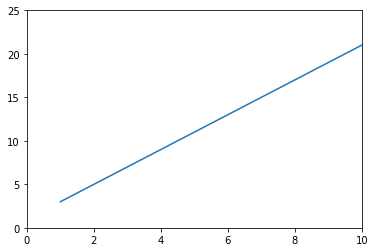
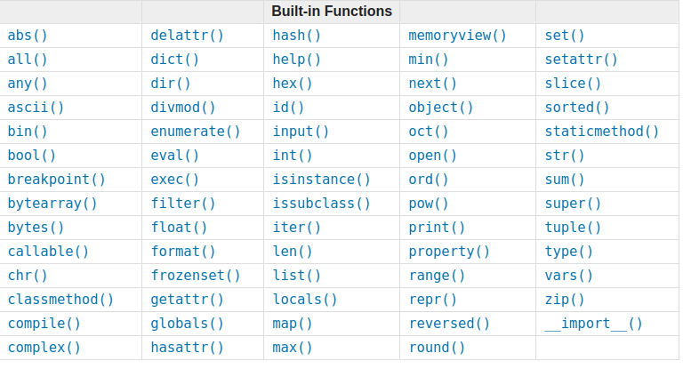
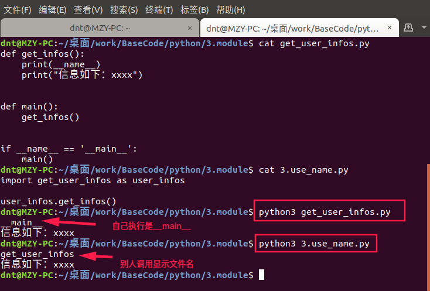
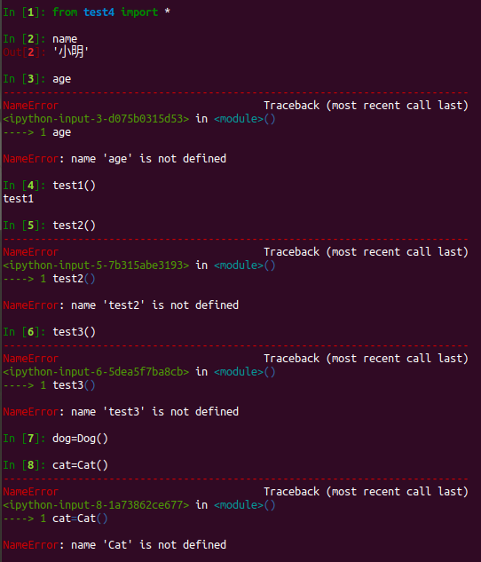
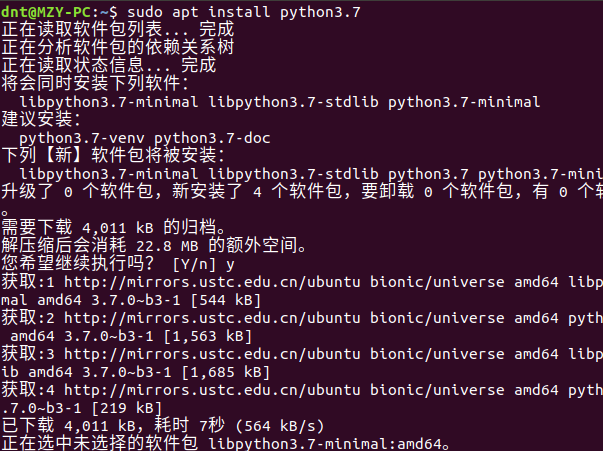
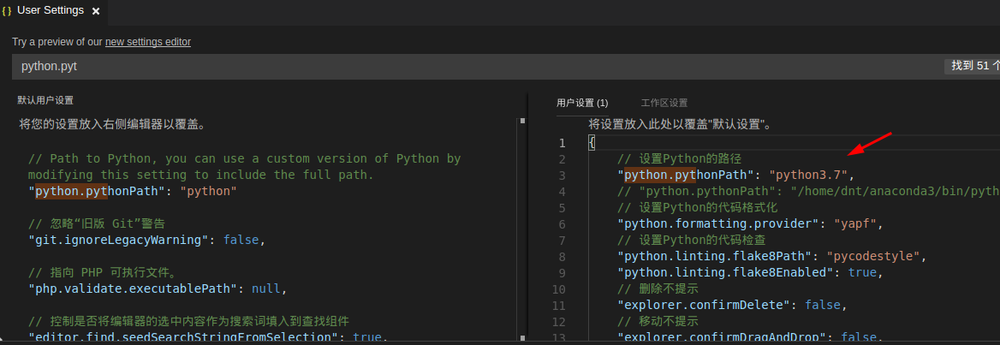
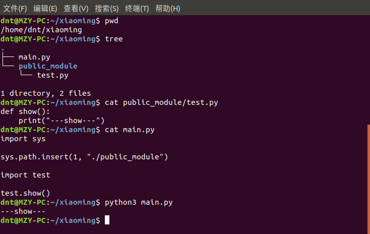
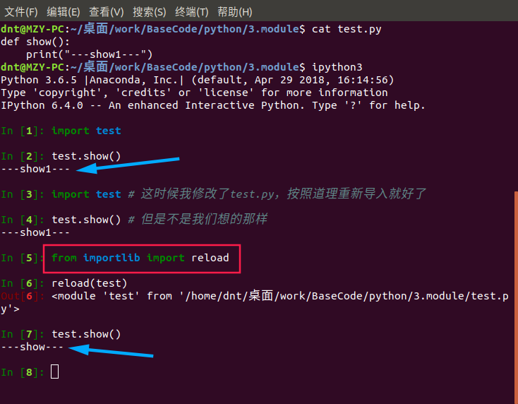
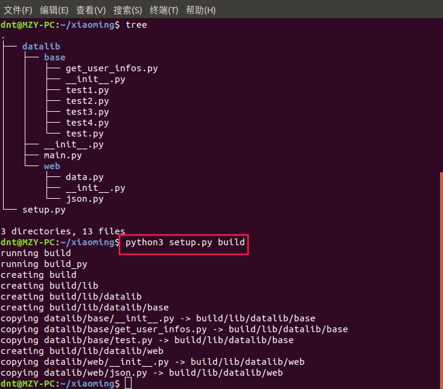

代码裤子：<a href="https://github.com/lotapp/BaseCode/tree/master" target="_blank">https://github.com/lotapp/BaseCode/tree/master</a>

在线编程：<a href="https://mybinder.org/v2/gh/lotapp/BaseCode/master" target="_blank">https://mybinder.org/v2/gh/lotapp/BaseCode/master</a>

在线预览：<a href="http://github.lesschina.com/python/base/module/模块专题.html" target="_blank">http://github.lesschina.com/python/base/module/模块专题.html</a>

老师休假度蜜月去了，这学期也到了尾声，小明同学觉得自己学的挺好的，在四处逛游的过程中看见了小潘的电脑，然后惊到了！


```python
# 导入matplotlib的pyplot模块
import matplotlib.pyplot as plt

x_list=list(range(1,11))
y_list=[y*2+1 for y in x_list]

print(x_list)
print(y_list)
```

    [1, 2, 3, 4, 5, 6, 7, 8, 9, 10]
    [3, 5, 7, 9, 11, 13, 15, 17, 19, 21]


```python
# 画图
plt.plot(x_list,y_list)
# 设置X，Y的坐标区间（可以不设置，用默认显示方式）
plt.axis([0,10,0,25])
# 显示图片
plt.show()
```





小潘昨晚螃蟹吃多了，今天拉肚子拉的不要不要的，现在去药店买紫苏和干姜来解蟹毒呢

怎么办呢，感觉自己不再萌萌哒了，好心情瞬间被比下去了，小明内心不断思索中....

作为一个吃胖了的小明，过了一分钟就调节好了，然后好好看小潘的Code

咦，第一句是啥？不管，继续看`x_list=list(range(1,11))` `y_list=[y*2+1 for y in x_list]`

这不是之前老师讲的<a href="https://www.cnblogs.com/dotnetcrazy/p/9155310.html#1.9.列表生成式" target="_blank">列表生成式</a>吗？然后就是画图了，好像也不是很难，开头到底是个啥，有了这个就可以几句话实现牛逼哄哄的技能了，不行得买瓶饮料问问课代表伟哥～

一进伟哥宿舍就发现，伟哥在给舍友们补课？这是要讲课的节奏吗？赶紧凑过来学习～

## 1.模块导入

模块就是一组功能的集合体，我们的程序可以导入模块来复用模块里的功能
 
在Python中，一个py文件就称之为一个 **模块**（Module）

我们先来讲讲 **模块怎么导入**，上学期我们学了点C，发现每个文件开头都有一个`#include <stdio.h>`

这个就类似我们说的模块导入了，咱们Python的模块导入和Java有点像用 `import` 来导入

先看个例子 ～ 我们定义了一个test.py文件，里面定义了这么一个函数：

```py
# %load test.py
def show():
    print("---show---")
```

我们想在新的py文件中使用这个函数

### 1.1.import导入方式1

`import test` 把这个文件直接导入进来了

```py
import test

test.show()
```
执行结果：
```
---show---
```

### 1.2.from…import导入方式2

有时候我们只需要用到模块中的某个函数，只需要引入该函数即可

`from test import show` 把这个文件的show方法导入进来，调用的时候直接`show()`即可

```py
from test import show

show()
```
执行结果：
```
---show---
```

**使用模块有什么好处？**

1. **提高了代码的维护性**，当一个模块编写完毕，就可以被其他地方引用。

2. 使用模块还可以 **避免函数名和变量名冲突**。相同名字的函数和变量完全可以分别存在不同的模块中

我们自己在编写模块时，不必考虑名字会与其他模块冲突(不要和<a href="https://docs.python.org/3/library/functions.html" blank="_self">内置函数</a>名字冲突)



### 1.3.导入多个模块

看着小明一愣一愣的，加上那瓶菊花茶的面子，课代表来了一个demo：

test1.py
```py
test_str = "111"

def show():
    print(__name__, "show")

```
test2.py
```py
test_str = "222"

def show():
    print(__name__, "show")

```

可以以`,`分隔（**这种导入方式，官方推荐多行导入**）
```py
import test1, test2

print(test1.test_str)

print(test2.test_str)

test1.show()

test2.show()
```
结果：
```
111
222
test1 show
test2 show
```

还可以用这种方式，该模块里面的函数名、变量名以逗号分隔（不用多行）

通过这种方式引入的时候，是当两个模块中含有相同名称函数的时候，后面一次引入会覆盖前一次引入，所以用`as`来避免一下

```py
from test1 import show as show1, test_str as test_str1
from test2 import show as show2, test_str as test_str2

print(test_str1)
print(test_str2)

show1()
show2()
```
结果：
```
111
222
test1 show
test2 show
```
如果想引入模块中所有东西可以用 **`from 模块名 import *`**，这样所有**被允许**(过会讲)的变量和函数都被导入进来了(**少用**)

`from 模块名 import` 好处：使用起来方便了，坏处：容易与当前执行文件中的名字冲突

## 2.模块的简单自测试

小明恍然大悟，盯着`__name__`看了好久，然后结合前面的知识，乘着旁边位置电脑没人，写了一半的demo卡壳了：

get_infos.py
```py
def get_infos():
    print("信息如下：xxxx")

def main():
    get_infos()

if __name__ == '__main__':
    main()
```

伟哥过来瞟了一眼继续讲到：

之前老师讲面向对象的时候有提到标准格式写法：
```py
def main():
    get_infos()

if __name__ == '__main__':
    main()
```
python文件可以有两种用途：

1. 当做 **脚本**来单独使用或者执行
2. 当做 **模块**来给别人调用

那怎么区分呢？就要用到`__name__`了

我们来看个案例就懂了：

get_user_infos.py
```py
def get_infos():
    print(__name__)
    print("信息如下：xxxx")

def main():
    get_infos()

if __name__ == '__main__':
    main()
```
再定义一个函数来调用它
```py
import get_user_infos as user_infos

user_infos.get_infos()
```

**直接执行的时候`__name__`等于`__main__`，别人调用的时候显示该文件名**



这样的好处就是==> 避免被别人导入的时候执行某些Code

小明乐坏了，平时和小潘以前做项目老被吐槽，学了这个得好好嘲讽一下小潘了

以后再也不怕直接py文件各种问题了，咱们可以先简单自测一下O(∩_∩)O哈！

## 3.控制可使用的函数、变量、类

### 3.1.通过私有来控制

在一个模块中，我们可能会定义很多函数和变量，但有的函数和变量我们希望给别人使用，有的函数和变量我们希望仅仅在模块内部使用。在Python中，是通过`_`前缀来实现的

小明同学基础功底扎实，看见标题小明就乐了，前面看了这么多案例瞬间秒懂，大叫道～”等一下～～～我来写demo，要是不行请你们吃晚饭～“

写下了如下代码：

test3.py
```py
def test1():
    print("test1")


def _test2():
    print("test2")


def __test3():
    print("test3")
```
调用代码：
```py
import test3

test3.test1()
test3._test2()
test3.__test3()
```
结果：
```
test1
test2
test3
```
大家大眼瞪小眼的看着小明，嘴角边露出了阴谋的味道～

这下小明傻眼了，难道老师之前类的私有系列讲错了？

小平瞥了小明一眼说道，你自己的打开方式不对还怪老师咯？看我给你改改~

调用代码：
```py
from test3 import *

test1()
_test2()
__test3()
```
小明运行后就傻眼了，心想到，课代表这个宿舍卧虎藏龙啊，下次少来点，不然这点老底就被他们吃空了

`NameError: name '_test2' is not defined`

注释掉`_test2()`运行结果：
`NameError: name '__test3' is not defined`

小明有点尴尬，然后转了个话题，说道：”那import不是无敌了？我们的私有不给力啊？“

伟哥语重心长的说道：

类似`_xxx`和`__xxx`这样的函数或变量就是非公开的（private），不应该被直接引用

之所以我们说，“不应该”被直接引用，而不是“不能”被直接引用，是因为Python并没有一种方法可以完全限制访问private函数或变量

比如小明的那种方式就可以直接使用了，但是从编程习惯上不应该引用private函数或变量。

我们平时使用的时候：

**外部不需要引用的函数全部定义成private，只有外部需要引用的函数才定义为public**,然后导入的时候尽量使用**`from ... import`**

### 3.2.通过\__all\__来控制

来个案例即可：

test4.py
```py
__all__ = ["Dog", "test1", "name"]

class Animal(object):
    pass

class Dog(Animal):
    pass

class Cat(Animal):
    pass

def test1():
    print("test1")

def test2():
    print("test2")

def test3():
    print("test3")

name = "小明"
age = "22"
```
效果：只有`__all__`列表里面的才能被访问



## 4.二进制文件pyc

小明，看到使用的电脑出现了这么多的pyc文件，以为中毒了，慌了慌了，连忙问道："伟哥伟哥，这个pyc是啥啊？不会是病毒吧？"
```
├── 1.def_module.py
├── 2.use_module.py
├── 3.use_name.py
├── 4.use_module.py
├── 5.use_all_.py
├── get_user_infos.py
├── __pycache__
│   ├── get_user_infos.cpython-36.pyc
│   ├── test1.cpython-36.pyc
│   ├── test2.cpython-36.pyc
│   ├── test3.cpython-36.pyc
│   ├── test4.cpython-36.pyc
│   └── test.cpython-36.pyc
├── test1.py
├── test2.py
├── test3.py
├── test4.py
└── test.py

```
旁边小李嘲笑道～”这你都不知道“

为了 **提高加载模块的速度**，python解释器会在__pycache__目录中下缓存每个模块编译后的版本

格式为：**`模块名.Python版本号.pyc`** 这种命名规范保证了编译后的结果多版本共存

小明问道，那我更新文件它怎么办呢？

小李瞥了一眼说道：

Python检查源文件的修改时间与编译的版本进行对比，如果过期就自动重新编译

并且编译的模块是平台独立的，所以相同的库可以在不同的架构的系统之间共享

小明恍然大悟，说道：

这不类似于Java和Net嘛，将来咋们编写的东西都可以跨平台了啊，O(∩_∩)O~，反正是由python虚拟机来执行的，太方便了

PS：pyc文件是可以反编译的，因而它的出现仅仅是用来提升模块的加载速度的，不是用来加密的

## 5.自己添加模块路径

小明乘着大家休息的时候回宿舍拿了个笔记本，继续听道：

当你导入一个模块，Python解析器对模块位置的搜索顺序是：

1. 当前目录
2. 如果不在当前目录，Python则搜索在shell变量PYTHONPATH下的每个目录。
3. 如果都找不到，Python会查看默认路径。xinux下，默认路径一般为/usr/local/lib/python/
4. 模块搜索路径存储在system模块的`sys.path`变量中。变量里包含当前目录，PYTHONPATH和由安装过程决定的默认目录

**总之你看`sys.path`就对了**

前几天时间发布了Python3.7，我们设置vscode的运行环境为Python3.7，然后看看：


我用的是conda的一个路径,Python3.7相关的一下插件没那么完善，我用的是3.6系列，`3.7`你可以用来练习一下`新语法糖`

```
['', # 当前目录
'/usr/lib/python37.zip', '/usr/lib/python3.7', 
'/usr/lib/python3.7/lib-dynload',
 '/usr/local/lib/python3.7/dist-packages', 
 '/usr/lib/python3/dist-packages']
```

小明心想，我是省事直接装了个conda路径是啥呢？于是自己测试了下：


```python
# conda的默认搜索路径
import sys

print(sys.path)
```

    ['', '/home/dnt/anaconda3/lib/python36.zip', '/home/dnt/anaconda3/lib/python3.6', '/home/dnt/anaconda3/lib/python3.6/lib-dynload', '/home/dnt/.local/lib/python3.6/site-packages', '/home/dnt/anaconda3/lib/python3.6/site-packages', '/home/dnt/anaconda3/lib/python3.6/site-packages/IPython/extensions', '/home/dnt/.ipython']


运维方面用些许，平时用的不是很多，一带而过~

细心可以看到，sys.path是一个列表，那么你对其添加删除操作也是和list一样的

比如这个场景，服务器给不同的用户使用，又不想他们的程序访问到超过其文件夹外的文件（系统、其他用户）

那么可以弄一个公共的库文件夹（手段先不用管），用程序模拟一下


**这种方法是在运行时修改，运行结束后失效**

其实还可以设置环境变量`pythonpath`，该环境变量的内容会被自动添加到模块搜索路径中。设置方式与设置Path环境变量类似。

注意只需要添加你自己的搜索路径，Python自己本身的搜索路径不受影响。（列表第二个就是说的这个）


## 6.模块重新导入

import语句是可以在程序中的任意位置使用的,且针对同一个模块很import多次

为了防止你重复导入，python的优化手段是：

**第一次导入后就将模块名加载到内存了，后续的import语句仅是对已经加载到内存中的模块对象增加了一次引用，不会重新执行模块内的语句**

看个例子：


想要重新导入修改的模块，可以使用官方推荐的方法：`importlib`下面的`reload`方法

```py
from importlib import reload

reload(test)
```

当然了你也可以使用`imp`下面的`reload`方法（<a href="https://docs.python.org/3/library/imp.html" target="_blank">3.4往后，官方就不推荐使用 **imp** 了</a>）

### 6.1.循环导入的问题

稍微提一下循环导入（类似于C#循环引用），能避免就避免。

**子模块相对独立，尽量别相互导入，通过父模块来调用** (有点像微服务的感觉)

这样不会混乱也不会出现循环导入的问题了

如果项目里面真的出现了循环导入，那么可以这么解决（参考）：

1. 重新设计架构，解除相互引用的关系
2. 把import语句放置在模块的最后
3. 把import语句放置在函数中

## 7.常用模块

看到标题小明就乐了，这不～终于可以说话了，不用被他们压抑的不敢出声了～

之前说了很多，比如`time`,`random`,`sys`等等，这次再扩充几个用的比较多的模块

后面demo里面还会再说，可以自己学习一下（<a href="https://docs.python.org/3/library" target="_blank">官方文档</a>）（<a href="https://github.com/python/cpython/tree/3.7/Lib" target="_blank">源码文件</a>）

### 7.1.time and datetime

在Python中，通常有这几种方式来表示时间：

由于Python的**time**模块实现主要调用C库，所以各个平台可能有所不同

1. 时间戳（timestamp）：从1970年1月1日00:00:00开始按秒计算的偏移量
    - `type(time.time())` ==> `float`
    - 返回时间戳方式的函数主要有`time()`，`clock()`(这个Win和Xinux系列有些区别)等
2. 格式化的时间字符串
3. UTC世界标准时间(在中国为UTC+8)，DST（Daylight Saving Time）即夏令时。
    - 元组（struct_time）共有9个元素
    - 返回struct_time的函数主要有gmtime()，localtime()，strptime()

看到表格不用怀疑，没错，更详细可以看<a href="https://docs.python.org/3/library/time.html#time.struct_time" target="_blank">官方介绍</a>
```
| 索引　| 属性                    　| 值                        |
| ---- | -------------------------| ------------------------- |
| 0    | tm_year（年）             | eg:2018                   |
| 1    | tm_mon（月）              | range [1, 12]             |
| 2    | tm_mday（日）             | range [1, 31]             |
| 3    | tm_hour（时）             | range [0, 23]             |
| 4    | tm_min（分）              | range [0, 59]             |
| 5    | tm_sec（秒）              | range [0, 61]             |
| 6    | tm_wday（星期几）        　| range [0, 6]（0表示周日）   |
| 7    | tm_yday（一年中的第几天）   | range [1, 366]            |
| 8    | tm_isdst（是否是夏令时）  　| 0, 1 or -1                |
```

**`datetime`模块**

`datetime.datetime.now().strftime("%Y-%m-%d %X")`

主要是时间相关的封装，案例在time模块的下面：


```python
import time

# 时间戳，结果是float类型
print(time.time())

# 格式化的时间字符串：年-月-日 小时:分钟:秒
print(time.strftime("%Y-%m-%d %X"))


print(time.localtime())  # 本地时区的 struct_time
print(time.gmtime())  # UTC时区（世界标准时间）的struct_time

# time.mktime 将一个 struct_time 转化为时间戳
print(time.mktime(time.localtime()))

# t = time.localtime()
# print(time.asctime(t)) # 把一个表示时间的元组或者struct_time表示为这种形式：'Sun Jun 20 23:21:05 1993'
# print(time.asctime()) # 不写参数默认就是time.localtime()
```

    1530595914.981183
    2018-07-03 13:31:54
    time.struct_time(tm_year=2018, tm_mon=7, tm_mday=3, tm_hour=13, tm_min=31, tm_sec=54, tm_wday=1, tm_yday=184, tm_isdst=0)
    time.struct_time(tm_year=2018, tm_mon=7, tm_mday=3, tm_hour=5, tm_min=31, tm_sec=54, tm_wday=1, tm_yday=184, tm_isdst=0)
    1530595914.0


```python
import datetime

print(datetime.datetime.now())  # 当前时间 2018-07-03 13:02:20.824494
print(datetime.datetime.now().strftime("%Y-%m-%d %X"))  # 当前时间 2018-07-03 13:02:20

# 时间加减
print(datetime.datetime.now() + datetime.timedelta(3))  # 当前时间+3天
print(datetime.datetime.now() + datetime.timedelta(-3))  # 当前时间-3天
print(datetime.datetime.now() + datetime.timedelta(hours=3))  # 当前时间+3小时
print(datetime.datetime.now() + datetime.timedelta(minutes=30))  # 当前时间+30分
```

    2018-07-03 13:31:55.147268
    2018-07-03 13:31:55
    2018-07-06 13:31:55.147883
    2018-06-30 13:31:55.148109
    2018-07-03 16:31:55.148315
    2018-07-03 14:01:55.148532


### 7.2.random

`random`小明有好好研究，于是抢着讲解：

常用方法主要是这几个：

`random.random()`：大于0且小于1之间的小数

`random.randint(1, 3)`：[1,3] 大于等于1且小于等于3之间的整数

`random.randrange(1, 3)`：[1,3) 大于等于1且小于3之间的整数

`random.choice([4, 'a', [1, 2]])`：随机返回三者之一

`random.uniform(1, 3)`：大于1小于3的小数，如1.927109612082716

`random.sample(old_list, 5)`：从list中随机获取5个元素，作为一个片断返回

`random.shuffle(old_list)`：打乱list的顺序

下面来看看例子吧（最下面有个简单验证码的demo）:


```python
import random
```


```python
print(random.random())  # 大于0且小于1之间的小数

print(random.randint(1, 3))  # [1,3]    大于等于1且小于等于3之间的整数

print(random.randrange(1, 3))  # [1,3)    大于等于1且小于3之间的整数

print(random.choice([4, 'a', [1, 2]]))  # 随机返回三者之一

print(random.uniform(1, 3))  # 大于1小于3的小数，如1.927109612082716
```

    0.08269940155686328
    3
    2
    [1, 2]
    2.1607974783487136


```python
# 从list中随机获取N个元素，作为一个片断返回
old_list = [1, 2, 3, 4, 5, 6, 7, 8, 9, 10]
new_list = random.sample(old_list, 5)  # 从list中随机获取5个元素，作为一个片断返回
print(old_list)
print(new_list)  # 原有序列并没有改变
```

    [1, 2, 3, 4, 5, 6, 7, 8, 9, 10]
    [7, 6, 9, 10, 3]


```python
test_list = [1, 3, 5, 7, 9]
random.shuffle(test_list)  # 打乱test_list的顺序
print(test_list)
```

    [1, 5, 7, 9, 3]


```python
# 简单验证码的例子
import random


def get_code(n):
    """简单验证码"""
    code = ""
    for i in range(n):
        s1 = chr(random.randint(65, 90))  # 字母
        s2 = str(random.randint(0, 9))  # 数字
        code += random.choice([s1, s2])  # 随机返回s1 or s2
    return code


def main():
    print(get_code(4))


if __name__ == '__main__':
    main()

```

    KOOH


### 7.3.hashlib

一看到hashlib，小明就退缩了，只能继续听伟哥讲解：

官方文档：<a href="https://docs.python.org/3/library/hashlib.html" blank="_self">https://docs.python.org/3/library/hashlib.html</a>

简单hash：**`hashlib.sha256(pass_str.encode("utf-8")).hexdigest()`**

和key一起加密：
```py
import hashlib

pass_str = "123456"

m = hashlib.sha256()

m.update(pass_str.encode("utf-8"))

m.update("你设置的key".encode("utf-8"))

pass_str_new = m.hexdigest()
```

扩展：python 还有一个`hmac`模块，它内部对我们创建`key`和`pass`进行处理后再加密：<a href="https://docs.python.org/3/library/hmac.html" blank="_self">https://docs.python.org/3/library/hmac.html</a>


```python
import hashlib

pass_str = "123456"
```


```python
# 简单hash一下
m = hashlib.sha256()

m.update(pass_str.encode("utf-8"))

pass_str_new = m.hexdigest()

print(pass_str_new)
print(len(pass_str_new))
```

    8d969eef6ecad3c29a3a629280e686cf0c3f5d5a86aff3ca12020c923adc6c92
    64


```python
# 简写：
hashlib.sha256(pass_str.encode("utf-8")).hexdigest()
```


    '8d969eef6ecad3c29a3a629280e686cf0c3f5d5a86aff3ca12020c923adc6c92'


```python
# 简写这么方便为什么要像上面例子那么复杂呢？
# 直接加密的方式可以通过撞库破解，但你可以设置个key来加大难度
# 大部分网站都是用平台key + 用户key（可以是用户创建时间或者id之类的不变信息）来加密的
m = hashlib.sha256()

m.update(pass_str.encode("utf-8"))

m.update("你设置的key".encode("utf-8"))

pass_str_new = m.hexdigest()

print(pass_str_new)
print(len(pass_str_new))
```

    fadc86f44ab0f13346bf3293b5bc51112569a21e421809f93a096c917d7731ce
    64


常用模块里面还有很多，就不一一介绍了，比如：`functools`里面的偏函数`partial`

这个我们下次讲闭包相关知识会说的`functools.partial(函数名, 默认参数1，默认参数2...)`


## 8.第三方模块安装

第三方模块安装之前有说过：<a href="https://www.cnblogs.com/dotnetcrazy/p/9095793.html" target="_blank">https://www.cnblogs.com/dotnetcrazy/p/9095793.html</a>

简单提一下：（<a href="https://pypi.org" target="_blank">pip官网</a>）

```shell
pip install 模块名 # 正常

sudo pip install 模块名 # 没权限运行

pip install --user 模块名 # conda下的pip
```
貌似win下面有一个模块比较火**`virtualenv`**，作用好像可以使得pip安装的模块不会直接安装到系统中

因为逆天是Ubuntu的，所以具体的情况我不太清楚，你可以作为扩展了解下（<a href="http://www.cnblogs.com/zhaof/p/8358902.html" target="_blank">参考</a>）

---

## 9.包系列（导入、发布、安装）

如果不同的人编写的模块名相同怎么办？

小明抢答曰：”为了避免模块名冲突，Python又引入了按目录来组织模块的方法，称为包（Package）“

小张斜了一眼小明补充道：”相互间有联系功能的模块可以放在一个包里，这个包就有点像C#的文件夹和类库的概念了“

小明不服气的把小潘那段代码的开头贴了出来：`import matplotlib.pyplot as plt`，然后叫嚣道：”怎么样，这个肯定用到了包“

### 9.1.包的定义

课代表看着这两个活宝，然后继续讲解道：

**模块是一组Python代码的集合，可以使用其他模块，也可以被其他模块使用**

比如一个模块的名称是`A.B`， 那么他表示一个包`A`中的子模块`B`

刚说完，小明就得意的看着小张，然后继续听课：

创建自己的模块时，要注意：

1. 模块名要遵循Python变量命名规范，不要使用中文、特殊字符
2. 模块名不要和系统模块名冲突（<a href="https://docs.python.org/3/library/index.html" target="_blank">标准库</a>）


下面我们来一个简单的案例：

自己定义一个包，目录结构如下：（`__init__.py`是空文件）
```
web/
├── data.py
├── __init__.py
└── json.py
```
调用web包里面的`get_json()`方法：
```py
from web.json import get_json

get_json()
```
或者：
```py
import web.json as json

json.get_json()
```

**每一个包目录下面都会有一个`__init__.py`的文件，这个文件是必须存在的，否则Python就把这个目录当成普通目录**

`__init__.py`可以是空文件，编译器默认会把它认成名字是文件夹名的**模块**，eg:`web`


### 9.2.包的制定化 ～ 控制可使用的模块

还记得之前讲得`__all__`吧，如果你想控制包里面的模块能否被访问使用，可以使用它

比如web包下的__init__文件中写下这一句：**`__all__ = ["json"]`**

神奇的事情发生了：
```py
from web import *

json.get_json()

data.get_data()
```
在调用`data.get_data()`的时候出现了如下错误：
```
NameError: name 'data' is not defined
```

小明想到了自己当时的那顿饭，然后用当时的思路试了下：
```py
# 你这样调就不行了
import web

web.data.get_data()
```
发现和上面一样的错误，然后夸张的说道～“哈哈哈，这种方式无敌了，里面有谁能调`data模块`下的`get_data()方法`我就请他喝饮料！”

话刚落完，发现大家刷刷的提交了相同的代码：
```py
# 同样的，你硬是要调，python也拿你没办法
import web.data as data

data.get_data()
```
小明顿时崩溃了，自我安慰到：“反正都是要请你们吃晚饭的了，也不差这饮料了...”

### 9.3.发布一个包

把我们之前的Code做一个包，目录结构如下：
```
├── datalib
│   ├── base
│   │   ├── get_user_infos.py
│   │   ├── __init__.py
│   │   ├── test1.py
│   │   ├── test2.py
│   │   ├── test3.py
│   │   ├── test4.py
│   │   └── test.py
│   ├── __init__.py
│   ├── main.py
│   └── web
│       ├── data.py
│       ├── __init__.py
│       └── json.py
└── setup.py
```
模块的目录结构中包含一个setup.py文件，用于定义模块名称、包含的模块等模块信息

固定格式如下：
```py
setup(name="模块名称", version="版本", description="模块描述", author="模块作者", py_modules=[包含的模块内容])
```
以demo为例：
```py
from distutils.core import setup

setup(
    name="datalib",
    version="1.0",
    description="数据相关的模块",
    author="小明",
    py_modules=[
        "datalib.base.get_user_infos", "datalib.base.test", "datalib.web.json"
    ])
```
build命令（构建模块）：`python setup.py sdist` 来张图更形象：



build文件夹：
```
dnt@MZY-PC:~/xiaoming/build$ tree
.
└── lib
    └── datalib
        ├── base
        │   ├── get_user_infos.py
        │   ├── __init__.py
        │   └── test.py
        └── web
            ├── __init__.py
            └── json.py

```
生成发布压缩包：**`python3 setup.py sdist`** 他会帮你打包成一个`tar.gz`的压缩包

其实你不构建，直接sdist也是可以的

```
dnt@MZY-PC:~/xiaoming$ tree
.
├── datalib
│   ├── base
│   │   ├── get_user_infos.py
│   │   ├── __init__.py
│   │   ├── test1.py
│   │   ├── test2.py
│   │   ├── test3.py
│   │   ├── test4.py
│   │   └── test.py
│   ├── __init__.py
│   ├── main.py
│   └── web
│       ├── data.py
│       ├── __init__.py
│       └── json.py
├── dist
│   └── datalib-1.0.tar.gz
├── MANIFEST
└── setup.py
```

### 9.4.安装自己打包的模块

安装比较简单，如果是build文件夹，直接`sudo python setup.py install`

如果是tar.gz，那么解压后再执行`sudo python setup.py install`

当然了，也可以目录安装：`python setup.py install --prefix=路径`

查看包内容：`tar -tvf datalib-1.0.tar.gz`

解包：`tar -zxvf datalib-1.0.tar.gz`

这些基础命令如果还不是很熟悉的话，可以看看逆天2015年写的<a href="https://www.cnblogs.com/dunitian/p/4822807.html" target="_blank">LinuxBase</a>文档

其实说句心里话，2015开始摸索虚拟机中的Linux，几年提升肯定是有的，但是绝对没有这几个月的Linux真机开发来得快

逆天还是建议程序员尽快适应Linux环境开发，刚开始的确不方便，适应之后就感觉Win特别麻烦了...

很多东西一个指令就可以实现的，重复执行的东西写个脚本批量执行

当然了你Win下各种跑脚本也是一样的，但是别忘了～公司服务器基本上都是Linux的，该面对的总该来的，加油～

## CSharp包相关知识

Old C#相关的知识可以参考：<a href="https://www.cnblogs.com/dunitian/p/6015459.html" target="_blank">如何在nuget上传自己的包</a>

NetCore可以用打包命令：`dotnet-pack`来打包成Nuget包，<a href="https://docs.microsoft.com/zh-cn/dotnet/core/tools/dotnet-pack" target="_blank">官方文档</a>说的很详细了，就不一一复述了

打包当前目录中的项目：`dotnet pack`

打包 app1 项目：`dotnet pack ~/projects/app1/project.csproj`

打包当前目录中的项目并将生成的包放置到 nupkgs 文件夹：

`dotnet pack --output nupkgs`

将当前目录中的项目打包到 nupkgs 文件夹并跳过生成步骤：

`dotnet pack --no-build --output nupkgs`

使用 PackageVersion MSBuild 属性将包版本设置为 2.1.0：

`dotnet pack /p:PackageVersion=2.1.0`

打包特定目标框架的项目：

`dotnet pack /p:TargetFrameworks=net45`

打包项目，并使用特定运行时 (Windows 10) 进行还原操作（.NET Core SDK 2.0 及更高版本）：

`dotnet pack --runtime win10-x64`

小明听完了这节课，感叹道～ “模块用起来真是爽啊”

然后问道：“为什么老师没讲呢？”

其他人一起鄙视小明说道：“你自己睡大觉你自己心里没有点逼数吗？”

小明大囧，感觉饮料和饭钱真是白花了。。。（完）
