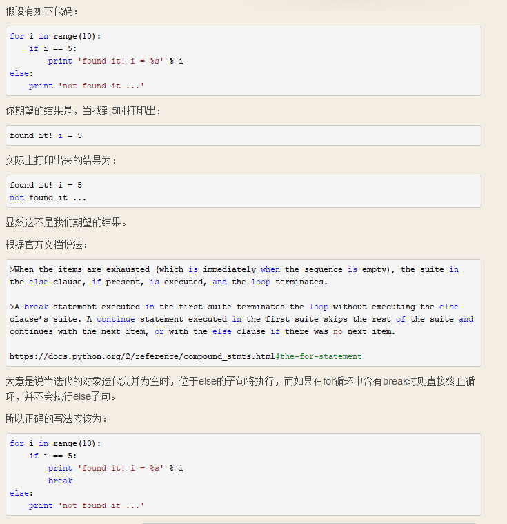

文章汇总：<a href="https://www.cnblogs.com/dotnetcrazy/p/9160514.html" target="_blank">https://www.cnblogs.com/dotnetcrazy/p/9160514.html</a>

多图旧排版：<a href="https://www.cnblogs.com/dunitian/p/9103673.html" target="_blank">https://www.cnblogs.com/dunitian/p/9103673.html</a>

VSCode设置python3的开发环境（linux下默认是python2）<a href="https://www.cnblogs.com/dotnetcrazy/p/9095793.html" target="_blank">https://www.cnblogs.com/dotnetcrazy/p/9095793.html</a>

欢迎提出更简单的语法~（文章中案例有两个福利哦，一个是养生，一个是人工智能[ 密码：fqif]）

先说下感觉，`python`的编程有点`JavaScript`的感觉(比如：'和“有时候不区别)，又感觉像外国版的易语言，整个过程像读书一样，比如一个元素不在列表之中==> `for item not in lists`。使用它做个大点的项目一定要先规定好编程风格，不然能让人崩溃的。先不深究，后面会继续深究。。。（Python2我就不讲了，官方推荐使用`Python3`）

## 1.命名规则

Python官方是推荐使用`_`来间隔单词，但一般开发人员都是以各自主语言的命名来定义的，这个就各人爱好了，不过团队一定要统一。

**命名规则**：总的原则就是 **见名知意**，一般都是 **驼峰命名法**，纯Python的话推荐用 **`_`连接单词**

扩充：`Python`的`关键词`可以自己打印一下：


```python
import keyword
print(keyword.kwlist)
```

    ['False', 'None', 'True', 'and', 'as', 'assert', 'break', 'class', 'continue', 'def', 'del', 'elif', 'else', 'except', 'finally', 'for', 'from', 'global', 'if', 'import', 'in', 'is', 'lambda', 'nonlocal', 'not', 'or', 'pass', 'raise', 'return', 'try', 'while', 'with', 'yield']


### 1.1.标识符
标示符由字母、下划线和数字组成，且数字不能开头（这个基本上都一样）注意：**标识符是区分大小写的**

### 1.2.Python


```python
# Python标识符区分大小写的案例
temp="xxx"
tEmp="==="
print(temp+tEmp)
```

    xxx===


### 1.3.CSharp


```python
%%script csharp
//CSharp标识符区分大小写的案例
var temp = "xxx";
var tEmp = "===";
Console.WriteLine(temp + tEmp);
```

    xxx===


## 2.注释

### 2.1.python

python输出就直接`print`即可，C是`printf`（**不要搞混哦**）

`#`**注释一行**，三个单引号或者三个双引号 **注释多行**：`'''XXX'''`或者`"""XXXX"""`（一般用`#`就够了，有点像`shell`脚本的感觉）


```python
#单行注释 输出
print("Hello World!")
```

    Hello World!


```python
'''三个单引号多行注释：
print("Hello World!")
print("Hello World!")
print("Hello World!")'''
```


    '三个单引号多行注释：\nprint("Hello World!")\nprint("Hello World!")\nprint("Hello World!")'


```python
"""三个双引号多行注释：
print("Hello World!")
print("Hello World!")
print("Hello World!")"""
```


    '三个双引号多行注释：\nprint("Hello World!")\nprint("Hello World!")\nprint("Hello World!")'


### 2.2.CSharp

C、Java、Net都是`//`注释一行，`/**/`注释多行
```csharp
Console.WriteLine("小明同学");
// Console.WriteLine("小明同学"); 注释一行
/*Console.WriteLine("小明同学");
Console.WriteLine("小明同学"); 注释多行*/
```

## 3.变量

### 3.1.Python

python定义变量比较牛逼，**直接写变量名**即可，句子后面 **不用加分号**，eg：`name="小明"`


```python
#定义一个变量并输出
name="小明"
print(name)
```

    小明


### 3.2.CSharp

可以用`var`来进行类型推断，eg：`var name="小明";`


```python
%%script csharp
var test = "123";//定义一个变量
Console.WriteLine(test);//输出这个变量
```

    123


## 4.输入输出

### 4.1.Python

**换行**输出，**不换行**输出：(**\n**使用这个就不说了，它们和C都是一样的)

python：`print("dnt.dkill.net/now",end='')` **默认end='\n' （' 和 " 随意）**


```python
print("dnt.dkill.net/now",end='')
print("带你走进中医经络")
```

    dnt.dkill.net/now带你走进中医经络


```python
print("dnt.dkill.net/now",end="")
print("带你走进中医经络")
```

    dnt.dkill.net/now带你走进中医经络


如果字符串内部既包含`'`又包含`"`怎么办？可以用转义字符`\`来标识


```python
#如果字符串内部既包含'又包含"怎么办？可以用转义字符\来标识
print("I\'m \"OK\"!")
```

    I'm "OK"!


`r''`表示`''`内部的字符串默认不转义


```python
# 如果字符串里面有很多字符都需要转义，就需要加很多\，为了简化，Python还允许用r''表示''内部的字符串默认不转义
print(r'\\\t\\')
```

    \\\t\\


`'''...'''`的格式表示多行内容


```python
#如果字符串内部有很多换行，用\n写在一行里不好阅读，为了简化，Python允许用'''...'''的格式表示多行内容
print('''我请你吃饭吧～
晚上吃啥？
去厕所，你说呢？''')
```

    我请你吃饭吧～
    晚上吃啥？
    去厕所，你说呢？


扩：Python提供一种以空格分隔的方式：


```python
print("I","Love","You")
```

    I Love You


python输出`多个重复字符`，不需要自己手打N个`*`或者`for`循环输出多个重复字符，eg：`print("x"*10)`


```python
print("x"*10)
```

    xxxxxxxxxx


如果你不太确定应该用什么，`%s`永远起作用，它会 **把任何数据类型转换为字符串**

```
%c    字符
%s    通过str() 字符串转换来格式化
%o    八进制整数
%x    十六进制整数（小写字母）
%X    十六进制整数（大写字母）
%e    指数（小写'e'）
%E    指数（大写“E”）
%f    浮点实数
%g    ％f和％e 的简写
%G    ％f和％E的简写
```

下面来个输入输出的简单的 **案例**吧：打印一张名片，**Name:毒逆天，Gender：男**

`print("Name:%s,Gender:%s"%(name,gender))`【**注意引号后面没有`，`哦**】


```python
#定义一个变量name,用户输入将赋值给name
name=input("请输入用户名:")

#定义一个变量gender，用户输入将赋值给gender
gender=input("请输入性别:")

#多个变量输出
print("Name:%s,Gender:%s"%(name,gender))
```

    请输入用户名:毒逆天
    请输入性别:男
    Name:毒逆天,Gender:男


### 4.2.CSharp

输出用：`Console.Write` `Console.WriteLine`


```python
%%script csharp
Console.Write("dnt.dkill.net/now");
Console.WriteLine("带你走进中医经络");
```

    dnt.dkill.net/now带你走进中医经络


C#用`@`来转义字符，不管你是转义字符还是换行，**通杀**


```python
%%script csharp
Console.WriteLine(@"\\\\\\\");
```

    \\\\\\\


```python
%%script csharp
Console.WriteLine(@"我请你吃饭吧～
晚上吃啥？
去厕所，你说呢？")
```

    我请你吃饭吧～
    晚上吃啥？
    去厕所，你说呢？


Csharp输入输出的简单的 **案例**：打印一张名片，`Name:毒逆天，Gender：男`

C#：`Console.WriteLine($"Name:{name}，Gender:{gender}");`
```csharp
Console.WriteLine("请输入用户名：");
var name = Console.ReadLine();

Console.WriteLine("请输入性别:");
var gender = Console.ReadLine();

Console.WriteLine($"Name:{name}，Gender:{gender}"); //推荐用法
Console.WriteLine("Name:{0}，Gender:{1}", name, gender); //Old 输出
```

## 5.类型转换

### 5.1.Python

**类型(值)**，eg:`int()`，`long()`，`float()`，`str()`，`list()`,`set()`...等等

Python没有 **double**类型哦~ 

**扩**：转换成 **16进制**：`hex()`、转换为 **8进制**：`oct()`


```python
# 求和
num1=input("输入第一个数字")
num2=input("输入第二个数字")

print("num1+num2=%d" %(int(num1)+int(num2)))
```

    输入第一个数字1
    输入第二个数字2
    num1+num2=3


### 5.2.Csharp

`C#`：该案例推荐使用 `int.TryParse`，我这边就用常用的`Convert`系列了【**支持类型比较多**】

`Convert.ToInt64()`,`Convert.ToDouble()`，`Convert.ToString()`...

```csharp
//类型转换
Console.WriteLine("输入第一个数字：");
var num1 = Console.ReadLine();
Console.WriteLine("输入第二个数字:");
var num2 = Console.ReadLine();
Console.WriteLine($"num1+num2={Convert.ToInt32(num1) + Convert.ToInt32(num2)}");
```

## 6.算术运算符

### 6.1.Python

算术运算符编程语言基本上差不多，Python多了个 `//` 取商（`%`是取余）和 幂`**`，来个案例：


```python
num=9
print("num=9，下面结果是对2的除，取余，取商操作：")
print(num/2.0)
print(num%2.0)
print(num//2.0)
print("2^3=%d"%2**3)
```

    num=9，下面结果是对2的除，取余，取商操作：
    4.5
    1.0
    4.0
    2^3=8


Python3现在这样写也行，`推荐和其他语言写法一致`（**不然你用惯了Python,切换的时候会出事的**）


```python
num=9
print("num=9，下面结果是对2的除，取余，取商操作：")
print(num/2)
print(num%2)
print(num//2)
print("2^3=%d"%2**3)
```

    num=9，下面结果是对2的除，取余，取商操作：
    4.5
    1
    4
    2^3=8


`+=` `-=` `*=` `/=` `%=` `**=` `//=` 这些就不用详说了吧？

举个例子：`c += a` 等效于 `c = c + a` 

注意下，**Python中不见得等效**，Python都是**引用**，这个先不说**后面说**

### 6.2.Csharp

C#常用数学方法都在`Match`类中


```python
%%script csharp
var num=9;
Console.WriteLine("num=9，下面结果是对2的除，取余，取商操作：")
Console.WriteLine(num/2.0);
Console.WriteLine(num%2.0);
Console.WriteLine(num/2);
Console.WriteLine(Math.Pow(2,3));
```

    num=9，下面结果是对2的除，取余，取商操作：
    4.5
    1
    4
    8


## 7.if else

### 7.1.Python

说Python像外国版的`易语言`，这边就可以看出来一点了，如果再结合Python命名规则就感觉在阅读文章一样

先说说Python的`逻辑运算符`：与`and` 或`or` 非`not`，这个倒是跟C、C#、Java等大大不同，和SQL倒是差不多

关系运算符和其他语言基本上差不多（`==` `!=` `<>` `>` `<` `>=` `<=`）

就一点不一样：不等于也可以用`<>`，这是兼容SQL的写法吗？

来个`if else`基础语法：**括号可加可不加**，但是**记得加`：`**。**不用大括号**，但是if里面的代码**注意缩进**


```python
age=19

if age>=18:
    print("成年了")
```

    成年了


再来个**嵌套**的：注意哦~ `else if` 在python里面 **简写**成了：**`elif`**


```python
age=24

if age>=23:
    print("七大姑曰：工作了吗？八大姨问：买房了吗？异性说：结婚了吗？")
elif age>=18:
    print(age)
    print("成年了哇")
else:
    print("好好学习天天向上")
```

    七大姑曰：工作了吗？八大姨问：买房了吗？异性说：结婚了吗？


结合前面知识，再来个案例：


```python
input_int=int(input("请输入（1-7)"))

#if后面的:,tab格式,else if 现在是elif
if input_int==1:
    print("星期一")
elif input_int==2:
    print("星期二")
elif input_int==3:
    print("星期三") 
elif input_int==4:
    print("星期四")
elif input_int==5:
    print("星期五")
elif input_int==6:
    print("星期六")
elif input_int==7:
    print("星期日")
else:
    print("别闹")
```

    请输入（1-7)2
    星期二


### 7.2.Csharp

C# `if else` **单行代码可以不用写括号**

```csharp
int age = 24;

if (age >= 23)
    Console.WriteLine("七大姑曰：工作了吗？八大姨问：买房了吗？异性说：结婚了吗？");
else if (age >= 18)
{
    Console.WriteLine(age);
    Console.WriteLine("成年了哇");
}
else
    Console.WriteLine("好好学习天天向上");
```

**NetCore现在推荐，如果是单行，建议`Code`和`if else`写在一行：**
```csharp
int age = 24;
if (age >= 23) Console.WriteLine("七大姑曰：工作了吗？八大姨问：买房了吗？异性说：结婚了吗？");
else if (age >= 18)
{
    Console.WriteLine(age);
    Console.WriteLine("成年了哇");
}
else Console.WriteLine("好好学习天天向上");
```

## 8.While

### 8.1.Python

python里面没有`++` 和 `--`，这点的确用的有点小不方便，**扩展部分有相关说明**

**while循环一般通过数值是否满足来确定循环的条件**

来几个个案例（PS：感觉用C了，捂脸^_^）


```python
num=10

while num>0: 
    print(num)
    num-=1
```

    10
    9
    8
    7
    6
    5
    4
    3
    2
    1


```python
i=1
#输出一个三角形
while i<6:
    j=1
    while j<=i:
        print("*",end="")#不换行输出
        j+=1
    print("")#下一行
    i+=1
```

    *
    **
    ***
    ****
    *****


```python
# 1~100求和
i=1
sum=0
while i<=100:
    sum+=i
    i+=1
print(sum)
```

    5050


### 8.2.Csharp

用法差不多，来个案例


```python
%%script csharp
int index = 1;
int sum = 0;
while (index <= 100)
{
    sum += index;
    index++;
}
Console.WriteLine(sum);
```

    5050


### 8.3.Python扩展（++ --）

其实Python分为 **可变类型**（`list`，`dict`,`set`等等）和 **不可变类型**（`int`，`str`，`tuple`等等）

像数字这类的是不可变类型（后面会继续说）所以结果往往和你预期的不一样哦～看个案例：


```python
# python 中，变量是以内容为基准而不是像 c 中以变量名为基准，所以只要你的数字内容是5
# 不管你起什么名字，这个变量的 ID 是相同的，同时也就说明了 python 中一个变量可以以多个名称访问
a=5
b=5

print(id(a))
print(id(b))
print(a is b)
a+=1

print(id(a))
print(id(b))
print(a is b)
```

    93994553510560
    93994553510560
    True
    93994553510592
    93994553510560
    False


你还可以看看这篇文章：**Python没有 ++/--** <a href="https://blog.csdn.net/somehow1002/article/details/73744626" target="_blank"> 参考文章（点我）</a>

## 9.for

### 9.1.Python

`python`的`for`循环，类似于`js`里面的`for in`

当然了，python的`for`还有很多诸如`列表生成式`的便捷功能，基础部分先不说

看个基础案例：


```python
# 基础循环：后面会讲range
for i in range(5):
    print(i)
    i+=1
```

    0
    1
    2
    3
    4


```python
#while循环一般通过数值是否满足来确定循环的条件
#for循环一般是对能保存多个数据的变量，进行遍历
name="https://pan.baidu.com/s/1weaF2DGsgDzAcniRzNqfyQ#mmd"

for i in name:
    if i=='#':
        break
    print(i,end='')#另一种写法：print("%s"%i,end="")
print('\n end ...')
```

    https://pan.baidu.com/s/1weaF2DGsgDzAcniRzNqfyQ
     end ...


### 9.2.Csharp

`foreach (var i in name)`


```python
%%script csharp
var url = "https://pan.baidu.com/s/1weaF2DGsgDzAcniRzNqfyQ#mmd";
foreach (var item in url)
{
    if (item == '#')
        break;
    Console.Write(item);
}
Console.WriteLine("\n end ...");
```

    https://pan.baidu.com/s/1weaF2DGsgDzAcniRzNqfyQ
     end ...


### 9.3.Python扩展（for else）

for的扩展：`for else`（一般不太用）

**官方参考**：<a href="https://docs.python.org/3/reference/compound_stmts.html#the-for-statement" target="_blank">https://docs.python.org/3/reference/compound_stmts.html#the-for-statement</a>



图片出处：<a href="https://www.cnblogs.com/dspace/p/6622799.html" target="_blank">https://www.cnblogs.com/dspace/p/6622799.html</a>

## 其他扩展

### 1.Python 没有 switch / case 语句

Python 没有`switch / case`语句。为了实现它，我们可以使用`字典映射`：

官方的解释说：<a href="https://docs.python.org/3.6/faq/design.html#why-isn-t-there-a-switch-or-case-statement-in-python" target="_blank">https://docs.python.org/3.6/faq/design.html#why-isn-t-there-a-switch-or-case-statement-in-python</a>

"用`if... elif... elif... else`序列很容易来实现`switch / case`语句,而且可以使用函数字典映射和类的调度方法"

```py
def numbers_to_strings(argument):
switcher = {
    0: "zero",
    1: "one",
    2: "two",
}
return switcher.get(argument, "nothing")
```
这段代码类似于：
```
function(argument){
    switch(argument) {
        case 0:
            return "zero";
        case 1:
            return "one";
        case 2:
            return "two";
        default:
            return "nothing";
    };
};
```
**在Python中字典映射也可以包含函数或者 lambda 表达式：**
```py
def zero():
    return "zero"
 
def one():
    return "one"
 
def numbers_to_functions_to_strings(argument):
    switcher = {
        0: zero,
        1: one,
        2: lambda: "two",
    }
    func = switcher.get(argument, lambda: "nothing")
    return func()
```
**类的调度方法**:

如果在一个类中，不确定要使用哪种方法，可以用一个调度方法在运行的时候来确定
```py
class Switcher(object):
    def numbers_to_methods_to_strings(self, argument):
        method_name = 'number_' + str(argument)
        method = getattr(self, method_name, lambda: "nothing")
        return method()
 
    def number_0(self):
        return "zero"
 
    def number_1(self):
        return "one"
 
    def number_2(self):
        return "two"
```

**Python设计相关的为什么，可以参考官方文档**：<a href="https://docs.python.org/3.6/faq/design.html" target="_blank">https://docs.python.org/3.6/faq/design.html</a>

### 2.Csharp基础笔记

C#基础（逆天上学那会做的笔记）

<a href="https://images2018.cnblogs.com/blog/658978/201806/658978-20180607154628616-1225096525.jpg" target="_blank">易忘知识点</a>

<a href="https://images2018.cnblogs.com/blog/658978/201806/658978-20180607154702861-1611313816.jpg" target="_blank">C#基础汇总</a>

<a href="https://images2018.cnblogs.com/blog/658978/201806/658978-20180607155437373-1409607729.png" target="_blank">异常概况系</a>

**其实有了Code，笔记也就没啥用了，知识点直接Code验证一下即可**

<a href="https://github.com/dunitian/LoTCodeBase/tree/master/NetCode/1.面向过程" target="_blank">CodeBase ~ POP</a>

<a href="https://github.com/dunitian/LoTCodeBase/tree/master/NetCode/2.面向对象" target="_blank">CodeBase ~ OOP</a>

欢迎纠正+补充～
